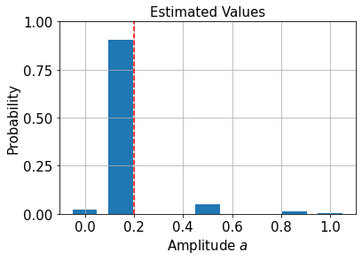
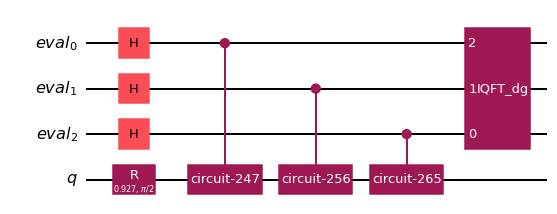
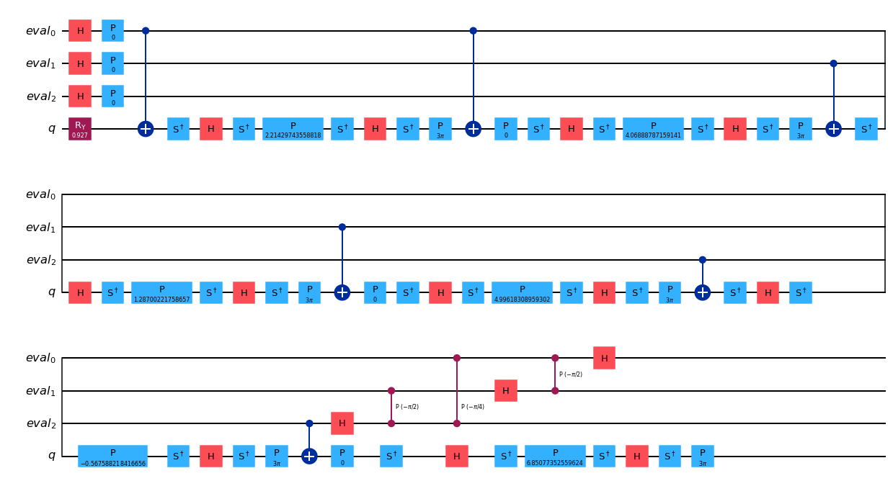
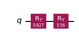

# Quantum Amplitude Estimation

Given an operator $\mathcal{A}$ that acts as

$$
    \mathcal{A}|0\rangle = \sqrt{1 - a}|\Psi_0\rangle + \sqrt{a}|\Psi_1\rangle
$$

Quantum Amplitude Estimation (QAE) is the task of finding an estimate for the amplitude $a$ of the state $|\Psi_1\rangle$:

$$
    a = |\langle\Psi_1 | \Psi_1\rangle|^2.
$$

This task has first been investigated by Brassard et al. [1] in 2000 and their algorithm uses a combination of the Grover operator 

$$
    \mathcal{Q} = \mathcal{A}\mathcal{S}_0\mathcal{A}^\dagger\mathcal{S}_{\Psi_1}
$$

where $\mathcal{S}_0$ and $\mathcal{S}_{\Psi_1}$ are reflections about the $|0\rangle$ and $|\Psi_1\rangle$ states, respectively, and phase estimation. However this algorithm, called `AmplitudeEstimation` in Qiskit, requires large circuits and is computationally expensive. Therefore, other variants of QAE have been proposed, which we will showcase in this tutorial for a simple example.

In our example, $\mathcal{A}$ describes a Bernoulli random variable with (assumed to be unknown) success probability $p$:

$$
    \mathcal{A}|0\rangle = \sqrt{1 - p}|0\rangle + \sqrt{p}|1\rangle.
$$

On a quantum computer, we can model this operator with a rotation around the $Y$-axis of a single qubit

$$
\mathcal{A} = R_Y(\theta_p), \theta_p = 2\sin^{-1}(\sqrt{p}).
$$

The Grover operator for this case is particularly simple

$$
\mathcal{Q} = R_Y(2\theta_p),
$$

whose powers are very easy to calculate: $\mathcal{Q}^k = R_Y(2k\theta_p)$.

We'll fix the probability we want to estimate to $p = 0.2$.


```python
p = 0.2
```

Now we can define circuits for $\mathcal{A}$ and $\mathcal{Q}$. 


```python
import numpy as np
from qiskit.circuit import QuantumCircuit


class BernoulliA(QuantumCircuit):
    """A circuit representing the Bernoulli A operator."""

    def __init__(self, probability):
        super().__init__(1)  # circuit on 1 qubit

        theta_p = 2 * np.arcsin(np.sqrt(probability))
        self.ry(theta_p, 0)


class BernoulliQ(QuantumCircuit):
    """A circuit representing the Bernoulli Q operator."""

    def __init__(self, probability):
        super().__init__(1)  # circuit on 1 qubit

        self._theta_p = 2 * np.arcsin(np.sqrt(probability))
        self.ry(2 * self._theta_p, 0)

    def power(self, k):
        # implement the efficient power of Q
        q_k = QuantumCircuit(1)
        q_k.ry(2 * k * self._theta_p, 0)
        return q_k
```


```python
A = BernoulliA(p)
Q = BernoulliQ(p)
```

### Qiskit's Amplitude Estimation workflow

Qiskit implements several QAE algorithms that all derive from the `AmplitudeEstimator` interface. In the initializer we specify algorithm specific settings and the `estimate` method, which does all the work, takes an `EstimationProblem` as input and returns an `AmplitudeEstimationResult` object. Since all QAE variants follow the same interface, we can use them all to solve the same problem instance. 

Next, we'll run all different QAE algorithms. To do so, we first define the estimation problem which will contain the $\mathcal{A}$ and $\mathcal{Q}$ operators as well as how to identify the $|\Psi_1\rangle$ state, which in this simple example is just $|1\rangle$.


```python
from qiskit.algorithms import EstimationProblem

problem = EstimationProblem(
    state_preparation=A,  # A operator
    grover_operator=Q,  # Q operator
    objective_qubits=[0],  # the "good" state Psi1 is identified as measuring |1> in qubit 0
)
```

To execute circuits we'll use Qiskit's statevector simulator.


```python
from qiskit import BasicAer
from qiskit.utils import QuantumInstance

backend = BasicAer.get_backend("statevector_simulator")
quantum_instance = QuantumInstance(backend)
```

### Canonical AE

Now let's solve this with the original QAE implementation by Brassard et al. [1].


```python
from qiskit.algorithms import AmplitudeEstimation

ae = AmplitudeEstimation(
    num_eval_qubits=3,  # the number of evaluation qubits specifies circuit width and accuracy
    quantum_instance=quantum_instance,
)
```

With the algorithm defined, we can call the `estimate` method and provide it with the problem to solve.


```python
ae_result = ae.estimate(problem)
```

The estimate is available in the `estimation` key:


```python
print(ae_result.estimation)
```

    0.1464466


We see that this is not a very good estimate for our target of $p=0.2$! That's due to the fact the canonical AE is restricted to a discrete grid, specified by the number of evaluation qubits:


```python
import matplotlib.pyplot as plt

# plot estimated values
gridpoints = list(ae_result.samples.keys())
probabilities = list(ae_result.samples.values())

plt.bar(gridpoints, probabilities, width=0.5 / len(probabilities))
plt.axvline(p, color="r", ls="--")
plt.xticks(size=15)
plt.yticks([0, 0.25, 0.5, 0.75, 1], size=15)
plt.title("Estimated Values", size=15)
plt.ylabel("Probability", size=15)
plt.xlabel(r"Amplitude $a$", size=15)
plt.ylim((0, 1))
plt.grid()
plt.show()
```


    

    


To improve the estimate we can interpolate the measurement probabilities and compute the maximum likelihood estimator that produces this probability distribution:


```python
print("Interpolated MLE estimator:", ae_result.mle)
```

    Interpolated MLE estimator: 0.19999999390907777


We can have a look at the circuit that AE executes:


```python
ae_circuit = ae.construct_circuit(problem)
ae_circuit.decompose().draw(
    "mpl", style="iqx"
)  # decompose 1 level: exposes the Phase estimation circuit!
```


    

    


```python
from qiskit import transpile


basis_gates = ["h", "ry", "cry", "cx", "ccx", "p", "cp", "x", "s", "sdg", "y", "t", "cz"]
transpile(ae_circuit, basis_gates=basis_gates, optimization_level=2).draw("mpl", style="iqx")
```


    

    


### Iterative Amplitude Estimation

See [2].


```python
from qiskit.algorithms import IterativeAmplitudeEstimation

iae = IterativeAmplitudeEstimation(
    epsilon_target=0.01,  # target accuracy
    alpha=0.05,  # width of the confidence interval
    quantum_instance=quantum_instance,
)
iae_result = iae.estimate(problem)

print("Estimate:", iae_result.estimation)
```

    Estimate: 0.19999999999999998


The circuits here only consist of Grover powers and are much cheaper!


```python
iae_circuit = iae.construct_circuit(problem, k=3)
iae_circuit.draw("mpl", style="iqx")
```


    

    


### Maximum Likelihood Amplitude Estimation

See [3].


```python
from qiskit.algorithms import MaximumLikelihoodAmplitudeEstimation

mlae = MaximumLikelihoodAmplitudeEstimation(
    evaluation_schedule=3, quantum_instance=quantum_instance  # log2 of the maximal Grover power
)
mlae_result = mlae.estimate(problem)

print("Estimate:", mlae_result.estimation)
```

    Estimate: 0.20002237175368104


### Faster Amplitude Estimation

See [4].


```python
from qiskit.algorithms import FasterAmplitudeEstimation

fae = FasterAmplitudeEstimation(
    delta=0.01,  # target accuracy
    maxiter=3,  # determines the maximal power of the Grover operator
    quantum_instance=quantum_instance,
)
fae_result = fae.estimate(problem)

print("Estimate:", fae_result.estimation)
```

    Estimate: 0.20000000000000018


    /usr/local/lib/python3.8/dist-packages/qiskit/algorithms/amplitude_estimators/estimation_problem.py:194: UserWarning: Rescaling discards the Grover operator.
      warnings.warn("Rescaling discards the Grover operator.")


### References

[1] Quantum Amplitude Amplification and Estimation. Brassard et al (2000). https://arxiv.org/abs/quant-ph/0005055

[2] Iterative Quantum Amplitude Estimation. Grinko, D., Gacon, J., Zoufal, C., & Woerner, S. (2019). https://arxiv.org/abs/1912.05559

[3] Amplitude Estimation without Phase Estimation. Suzuki, Y., Uno, S., Raymond, R., Tanaka, T., Onodera, T., & Yamamoto, N. (2019). https://arxiv.org/abs/1904.10246

[4] Faster Amplitude Estimation. K. Nakaji (2020). https://arxiv.org/pdf/2003.02417.pdf


```python
import qiskit.tools.jupyter

%qiskit_version_table
%qiskit_copyright
```


<h3>Version Information</h3><table><tr><th>Qiskit Software</th><th>Version</th></tr><tr><td><code>qiskit-terra</code></td><td>0.21.1</td></tr><tr><td><code>qiskit-aer</code></td><td>0.10.4</td></tr><tr><td><code>qiskit-ibmq-provider</code></td><td>0.19.2</td></tr><tr><td><code>qiskit-nature</code></td><td>0.5.0</td></tr><tr><td><code>qiskit-finance</code></td><td>0.4.0</td></tr><tr><td><code>qiskit-optimization</code></td><td>0.4.0</td></tr><tr><td><code>qiskit-machine-learning</code></td><td>0.5.0</td></tr><tr><th>System information</th></tr><tr><td>Python version</td><td>3.8.10</td></tr><tr><td>Python compiler</td><td>GCC 9.4.0</td></tr><tr><td>Python build</td><td>default, Jun 22 2022 20:18:18</td></tr><tr><td>OS</td><td>Linux</td></tr><tr><td>CPUs</td><td>12</td></tr><tr><td>Memory (Gb)</td><td>31.267112731933594</td></tr><tr><td colspan='2'>Sat Jul 30 15:22:16 2022 CEST</td></tr></table>


<div style='width: 100%; background-color:#d5d9e0;padding-left: 10px; padding-bottom: 10px; padding-right: 10px; padding-top: 5px'><h3>This code is a part of Qiskit</h3><p>&copy; Copyright IBM 2017, 2022.</p><p>This code is licensed under the Apache License, Version 2.0. You may<br>obtain a copy of this license in the LICENSE.txt file in the root directory<br> of this source tree or at http://www.apache.org/licenses/LICENSE-2.0.<p>Any modifications or derivative works of this code must retain this<br>copyright notice, and modified files need to carry a notice indicating<br>that they have been altered from the originals.</p></div>


```python

```
