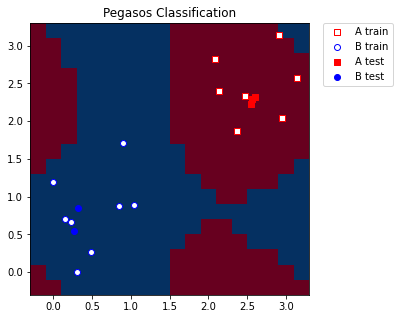

# Pegasos Quantum Support Vector Classifier

There's another SVM based algorithm that benefits from the quantum kernel method. Here, we introduce an implementation of a another classification algorithm, which is an alternative version to the QSVC shown above. This classification algorithm implements the Pegasos algorithm from the paper "Pegasos: Primal Estimated sub-GrAdient SOlver for SVM" by Shalev-Shwartz et al., see: https://home.ttic.edu/~nati/Publications/PegasosMPB.pdf.

This algorithm is an alternative to the dual optimization from the `scikit-learn` package, benefits from the kernel trick, and yields a training complexity that is independent of the size of the training set. Thus, the `PegasosQSVC` is expected to train faster than QSVC for sufficiently large training sets.

The algorithm can be used as direct replacement of `QSVC` with some hyper-parameterization.

Let's generate some data:


```python
from sklearn.datasets import make_blobs

# example dataset
features, labels = make_blobs(n_samples=20, n_features=2, centers=2, random_state=3, shuffle=True)
```

We pre-process the data to ensure compatibility with the rotation encoding and split it into the training and test datasets.


```python
import numpy as np

from sklearn.model_selection import train_test_split
from sklearn.preprocessing import MinMaxScaler

features = MinMaxScaler(feature_range=(0, np.pi)).fit_transform(features)

train_features, test_features, train_labels, test_labels = train_test_split(
    features, labels, train_size=15, shuffle=False
)
```

We have two features in the dataset, so we set a number of qubits to the number of features in the dataset.

Then we set $\tau$ to the number of steps performed during the training procedure. Please note that, there is no early stopping criterion in the algorithm. The algorithm iterates over all $\tau$ steps.

And the last one is the hyperparameter $C$. This is a positive regularization parameter. The strength of the regularization is inversely proportional to $C$. Smaller $C$ induce smaller weights which generally helps preventing overfitting. However, due to the nature of this algorithm, some of the computation steps become trivial for larger $C$. Thus, larger $C$ improve the performance of the algorithm drastically. If the data is linearly separable in feature space, $C$ should be chosen to be large. If the separation is not perfect, $C$ should be chosen smaller to prevent overfitting.


```python
# number of qubits is equal to the number of features
num_qubits = 2

# number of steps performed during the training procedure
tau = 100

# regularization parameter
C = 1000
```

The algorithm will run using:

- A statevector simulator
- A quantum kernel created from `ZFeatureMap`


```python
from qiskit import BasicAer
from qiskit.circuit.library import ZFeatureMap
from qiskit.utils import QuantumInstance, algorithm_globals

from qiskit_machine_learning.kernels import QuantumKernel

algorithm_globals.random_seed = 12345

pegasos_backend = QuantumInstance(
    BasicAer.get_backend("statevector_simulator"),
    seed_simulator=algorithm_globals.random_seed,
    seed_transpiler=algorithm_globals.random_seed,
)

feature_map = ZFeatureMap(feature_dimension=num_qubits, reps=1)

qkernel = QuantumKernel(feature_map=feature_map, quantum_instance=pegasos_backend)
```

The implementation `PegasosQSVC` is compatible with the `scikit-learn` interfaces and has a pretty standard way of training a model. In the constructor we pass parameters of the algorithm, in this case there are a regularization hyper-parameter $C$ and a number of steps.

Then we pass training features and labels to the `fit` method, which trains a models and returns a fitted classifier.

Afterwards, we score our model using test features and labels.


```python
from qiskit_machine_learning.algorithms import PegasosQSVC

pegasos_qsvc = PegasosQSVC(quantum_kernel=qkernel, C=C, num_steps=tau)

# training
pegasos_qsvc.fit(train_features, train_labels)

# testing
pegasos_score = pegasos_qsvc.score(test_features, test_labels)
print(f"PegasosQSVC classification test score: {pegasos_score}")
```

    PegasosQSVC classification test score: 1.0


For visualization purposes we create a mesh grid of a predefined step that spans our minimum and maximum values we applied in MinMaxScaler. We also add some margin to the grid for better representation of the training and test samples.


```python
grid_step = 0.2
margin = 0.2
grid_x, grid_y = np.meshgrid(
    np.arange(-margin, np.pi + margin, grid_step), np.arange(-margin, np.pi + margin, grid_step)
)
```

We convert the grid to the shape compatible with the model, the shape should be `(n_samples, n_features)`.
Then for each grid point we predict a label. In our case predicted labels will be used for coloring the grid.


```python
meshgrid_features = np.column_stack((grid_x.ravel(), grid_y.ravel()))
meshgrid_colors = pegasos_qsvc.predict(meshgrid_features)
```

Finally, we plot our grid according to the labels/colors we obtained from the model. We also plot training and test samples.


```python
import matplotlib.pyplot as plt

plt.figure(figsize=(5, 5))
meshgrid_colors = meshgrid_colors.reshape(grid_x.shape)
plt.pcolormesh(grid_x, grid_y, meshgrid_colors, cmap="RdBu", shading="auto")

plt.scatter(
    train_features[:, 0][train_labels == 0],
    train_features[:, 1][train_labels == 0],
    marker="s",
    facecolors="w",
    edgecolors="r",
    label="A train",
)
plt.scatter(
    train_features[:, 0][train_labels == 1],
    train_features[:, 1][train_labels == 1],
    marker="o",
    facecolors="w",
    edgecolors="b",
    label="B train",
)

plt.scatter(
    test_features[:, 0][test_labels == 0],
    test_features[:, 1][test_labels == 0],
    marker="s",
    facecolors="r",
    edgecolors="r",
    label="A test",
)
plt.scatter(
    test_features[:, 0][test_labels == 1],
    test_features[:, 1][test_labels == 1],
    marker="o",
    facecolors="b",
    edgecolors="b",
    label="B test",
)

plt.legend(bbox_to_anchor=(1.05, 1), loc="upper left", borderaxespad=0.0)
plt.title("Pegasos Classification")
plt.show()
```


    

    


```python
import qiskit.tools.jupyter

%qiskit_version_table
%qiskit_copyright
```


<h3>Version Information</h3><table><tr><th>Qiskit Software</th><th>Version</th></tr><tr><td><code>qiskit-terra</code></td><td>0.21.1</td></tr><tr><td><code>qiskit-aer</code></td><td>0.10.4</td></tr><tr><td><code>qiskit-ibmq-provider</code></td><td>0.19.2</td></tr><tr><td><code>qiskit-nature</code></td><td>0.5.0</td></tr><tr><td><code>qiskit-finance</code></td><td>0.4.0</td></tr><tr><td><code>qiskit-optimization</code></td><td>0.4.0</td></tr><tr><td><code>qiskit-machine-learning</code></td><td>0.5.0</td></tr><tr><th>System information</th></tr><tr><td>Python version</td><td>3.8.10</td></tr><tr><td>Python compiler</td><td>GCC 9.4.0</td></tr><tr><td>Python build</td><td>default, Jun 22 2022 20:18:18</td></tr><tr><td>OS</td><td>Linux</td></tr><tr><td>CPUs</td><td>12</td></tr><tr><td>Memory (Gb)</td><td>31.267112731933594</td></tr><tr><td colspan='2'>Sat Jul 30 14:35:45 2022 CEST</td></tr></table>


<div style='width: 100%; background-color:#d5d9e0;padding-left: 10px; padding-bottom: 10px; padding-right: 10px; padding-top: 5px'><h3>This code is a part of Qiskit</h3><p>&copy; Copyright IBM 2017, 2022.</p><p>This code is licensed under the Apache License, Version 2.0. You may<br>obtain a copy of this license in the LICENSE.txt file in the root directory<br> of this source tree or at http://www.apache.org/licenses/LICENSE-2.0.<p>Any modifications or derivative works of this code must retain this<br>copyright notice, and modified files need to carry a notice indicating<br>that they have been altered from the originals.</p></div>

