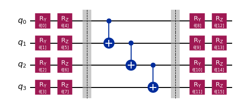

# Leveraging Qiskit Runtime 

Iterative algorithms, such as the Variational Quantum Eigensolver (VQE), traditionally send one batch of circuits (one "job") to be executed on the quantum device in each iteration. Sending a job involves certain overhead, mainly

* the time to process the requests and send the data (API overhead, usually about 10s)
* the job queue time, that is how long you have to wait before it's your turn to run on the device (usually about 2min)

If we send hundreds of jobs iteratively, this overhead quickly dominates the execution time of our algorithm.
Qiskit Runtime allows us to tackle these issues and significantly speed up (especially) iterative algorithms. With Qiskit Runtime, one job does not contain only a batch of circuits but the _entire_ algorithm. That means we only experience the API overhead and queue wait _once_ instead of in every iteration! You'll be able to either upload algorithm parameters and delegate all the complexity to the cloud, where your program is executed, or upload your personal algorithm directly.

For the VQE, the integration of Qiskit Runtime in your existing code is a piece of cake. There is a (almost) drop-in replacement, called `VQEProgram` for the `VQE` class.

Let's see how you can leverage the runtime on a simple chemistry example: Finding the ground state energy of the lithium hydrate (LiH) molecule at a given bond distance.

### *Important: Version requirements*

*This notebook requires a minimum version number of Qiskit Terra 0.18.0 and Qiskit Nature 0.3.0.*

## Problem specification: LiH molecule

First, we specify the molecule whose ground state energy we seek. Here, we look at LiH with a bond distance of 2.5 Å.


```python
from qiskit_nature.second_q.drivers import UnitsType, Molecule
from qiskit_nature.second_q.drivers import (
    ElectronicStructureDriverType,
    ElectronicStructureMoleculeDriver,
)
from qiskit_nature.second_q.problems import ElectronicStructureProblem
from qiskit_nature.second_q.mappers import QubitConverter
from qiskit_nature.second_q.mappers import ParityMapper
from qiskit_nature.second_q.properties import ParticleNumber
from qiskit_nature.second_q.transformers import ActiveSpaceTransformer
```


```python
bond_distance = 2.5  # in Angstrom

# define molecule
molecule = Molecule(
    geometry=[["Li", [0.0, 0.0, 0.0]], ["H", [0.0, 0.0, bond_distance]]], charge=0, multiplicity=1
)


# specify driver
driver = ElectronicStructureMoleculeDriver(
    molecule, basis="sto3g", driver_type=ElectronicStructureDriverType.PYSCF
)
properties = driver.run()

particle_number = properties.get_property(ParticleNumber)

# specify active space transformation
active_space_trafo = ActiveSpaceTransformer(
    num_electrons=particle_number.num_particles, num_molecular_orbitals=3
)

# define electronic structure problem
problem = ElectronicStructureProblem(driver, transformers=[active_space_trafo])

# construct qubit converter (parity mapping + 2-qubit reduction)
qubit_converter = QubitConverter(ParityMapper(), two_qubit_reduction=True)
```

## Classical reference solution

As a reference solution we can solve this system classically with the `NumPyEigensolver`.


```python
from qiskit.algorithms import NumPyMinimumEigensolver
from qiskit_nature.second_q.algorithms.ground_state_solvers import GroundStateEigensolver

np_solver = NumPyMinimumEigensolver()
np_groundstate_solver = GroundStateEigensolver(qubit_converter, np_solver)

np_result = np_groundstate_solver.solve(problem)
```

    /usr/local/lib/python3.8/dist-packages/qiskit_nature/second_q/problems/electronic_structure_problem.py:97: ListAuxOpsDeprecationWarning: List-based `aux_operators` are deprecated as of version 0.3.0 and support for them will be removed no sooner than 3 months after the release. Instead, use dict-based `aux_operators`. You can switch to the dict-based interface immediately, by setting `qiskit_nature.settings.dict_aux_operators` to `True`.
      second_quantized_ops = self._grouped_property_transformed.second_q_ops()


```python
import numpy as np

target_energy = np.real(np_result.eigenenergies + np_result.nuclear_repulsion_energy)[0]
print("Energy:", target_energy)
```

    Energy: -7.773617988868032


## VQE

To run the VQE we need to select a parameterized quantum circuit acting as ansatz and a classical optimizer. Here we'll choose a heuristic, hardware efficient ansatz and the SPSA optimizer.


```python
from qiskit.circuit.library import EfficientSU2

ansatz = EfficientSU2(num_qubits=4, reps=1, entanglement="linear", insert_barriers=True)
ansatz.decompose().draw("mpl", style="iqx")
```


    

    


```python
from qiskit.algorithms.optimizers import SPSA

optimizer = SPSA(maxiter=100)

np.random.seed(5)  # fix seed for reproducibility
initial_point = np.random.random(ansatz.num_parameters)
```

Before executing the VQE in the cloud using Qiskit Runtime, let's execute a local VQE first.


```python
from qiskit.providers.basicaer import QasmSimulatorPy  # local simulator
from qiskit.algorithms import VQE

local_vqe = VQE(
    ansatz=ansatz,
    optimizer=optimizer,
    initial_point=initial_point,
    quantum_instance=QasmSimulatorPy(),
)

local_vqe_groundstate_solver = GroundStateEigensolver(qubit_converter, local_vqe)
```


```python
%%time
local_vqe_result = local_vqe_groundstate_solver.solve(problem)
```


```python
print(
    "Energy:",
    np.real(local_vqe_result.eigenenergies + local_vqe_result.nuclear_repulsion_energy)[0],
)
```

    Energy: -7.526366223876955


## Runtime VQE

Let's exchange the eigensolver from a local VQE algorithm to a VQE executed using Qiskit Runtime -- simply by exchanging the `VQE` class by the `qiskit_nature.runtime.VQEClient`.

First, we'll have to load a provider to access Qiskit Runtime. **Note:** You have to replace the next cell with your provider.


```python
from qiskit import IBMQ

IBMQ.load_account()
provider = IBMQ.get_provider(project="main")  # replace by your runtime provider
```

    ibmqfactory.load_account:WARNING:2022-07-30 17:03:46,007: Credentials are already in use. The existing account in the session will be replaced.


```python
backend = provider.get_backend("ibm_nairobi")  # select a backend that supports the runtime
```

Now we can set up the `VQEClient`. In this first release, the optimizer must be provided as a dictionary, in future releases you'll be able to pass the same optimizer object as in the traditional VQE.


```python
#from qiskit_nature.runtime import VQEClient
from qiskit.algorithms.optimizers import QNSPSA
from qiskit_optimization.runtime import VQEClient
```


```python
# Pass an qiskit.algorithms.optimizer.Optimizer object (like the ``optimizer`` variable from before)
# or SPSA/QN-SPSA as dictionary. Here we're using the dictionary version
#optimizer = {
#    "name": "QN-SPSA",  # leverage the Quantum Natural SPSA
#    # 'name': 'SPSA',  # set to ordinary SPSA
#    "maxiter": 100,
#    "resamplings": {1: 100},  # 100 samples of the QFI for the first step, then 1 sample per step
#}

# Get the Qiskit circuit from the library if a str was given
if isinstance(ansatz, str):
    ansatz_instance = getattr(lib_local, ansatz)
    ansatz_circuit = ansatz_instance(num_qubits, **ansatz_config)
else:
    ansatz_circuit = ansatz

fidelity = QNSPSA.get_fidelity(ansatz_circuit)
        
optimizer = QNSPSA(fidelity=fidelity, maxiter=100, resamplings={1:100})
runtime_vqe = VQEClient(
    ansatz=ansatz,
    optimizer=optimizer,
    initial_point=initial_point,
    provider=provider,
    backend=backend,
    shots=1024,
    measurement_error_mitigation=True,
)  # use a complete measurement fitter for error mitigation
```


```python
runtime_vqe_groundstate_solver = GroundStateEigensolver(qubit_converter, runtime_vqe)
```


```python
%%time
runtime_vqe_result = runtime_vqe_groundstate_solver.solve(problem)
```

    /usr/local/lib/python3.8/dist-packages/qiskit/providers/ibmq/runtime/utils.py:272: UserWarning: Callable <function QNSPSA.get_fidelity.<locals>.fidelity at 0x7f82948d03a0> is not JSON serializable and will be set to None.
      warnings.warn(f"Callable {obj} is not JSON serializable and will be set to None.")


```python
print(
    "Energy:",
    np.real(runtime_vqe_result.eigenenergies + runtime_vqe_result.nuclear_repulsion_energy)[0],
)
```

If we are interested in the development of the energy, the `VQEClient` allows access to the history of the optimizer, which contains the loss per iteration (along with the parameters and a timestamp). Note that this only holds for the SPSA and QN-SPSA optimizers. Otherwise you have to use a callback to the `VQEClient`, similar to the normal `VQE`.

We can access this data via the `raw_result` attribute of the ground state solver.


```python
runtime_result = runtime_vqe_result.raw_result
history = runtime_result.optimizer_history
loss = history["loss"]
```


```python
import matplotlib.pyplot as plt

plt.rcParams["font.size"] = 14

# plot loss and reference value
plt.figure(figsize=(12, 6))
plt.plot(loss + runtime_vqe_result.nuclear_repulsion_energy, label="Runtime VQE")
plt.axhline(y=target_energy + 0.2, color="tab:red", ls=":", label="Target + 200mH")
plt.axhline(y=target_energy, color="tab:red", ls="--", label="Target")

plt.legend(loc="best")
plt.xlabel("Iteration")
plt.ylabel("Energy [H]")
plt.title("VQE energy");
```


```python

```
