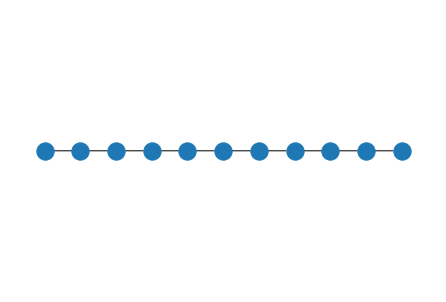
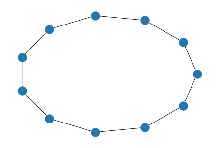
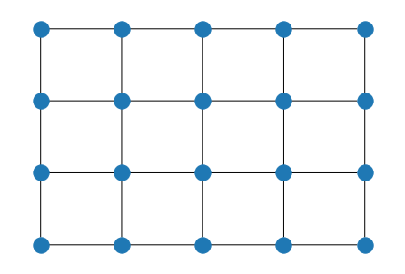
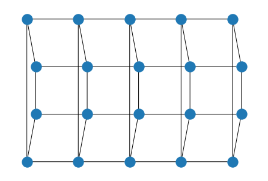
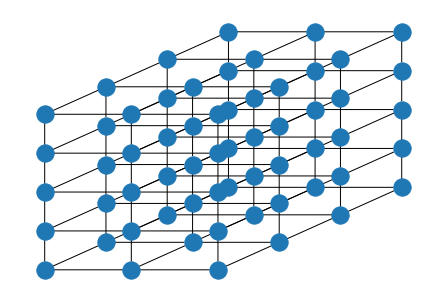
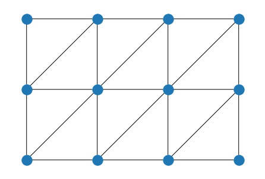
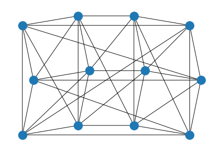
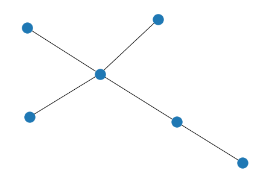
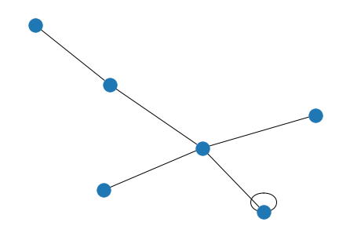
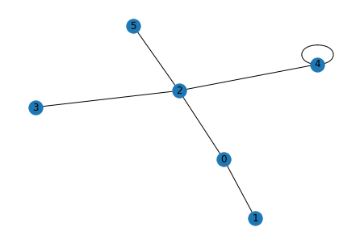

# Lattice models

## Introduction
In quantum physics (including condensed matter physics and high energy physics) we often study models on lattices. 
For example, when we think about behavior of electrons in a solid, we can study a model defined on a lattice by considering the positions of atoms as lattice points.
This notebook demonstrates how we can utilize `Lattice` classes to generate various lattice systems such as `LineLattice`, `SquareLattice`, `HyperCubicLattice`, `TriangularLattice`, and a general lattice. 
It also includes an example of a lattice model, the Fermi-Hubbard model. 
We see how we can define the Hamiltonian of the Fermi-Hubbard model for a given lattice using `FermiHubbardModel` class. 


```python
from math import pi

import numpy as np
import retworkx as rx
from qiskit_nature.second_q.properties.lattices import (
    BoundaryCondition,
    HyperCubicLattice,
    Lattice,
    LatticeDrawStyle,
    LineLattice,
    SquareLattice,
    TriangularLattice,
)
from qiskit_nature.second_q.properties import FermiHubbardModel
```

## LineLattice
`LineLattice` provides a one-dimensional lattice.
We can construct a one-dimensional lattice as follows.


```python
num_nodes = 11
boundary_condition = BoundaryCondition.OPEN
line_lattice = LineLattice(num_nodes=num_nodes, boundary_condition=boundary_condition)
```

Here, it is visualized.


```python
line_lattice.draw()
```


    

    


We can also construct a one-dimensional lattice with the periodic boundary conditions by specifying `BoundaryCondition.PERIODIC` as the argument of `boundary_condition`.


```python
num_nodes = 11
boundary_condition = BoundaryCondition.PERIODIC
line_lattice = LineLattice(num_nodes=num_nodes, boundary_condition=boundary_condition)

line_lattice.draw()
```


    

    


When we want to draw the lattice ignoring the boundary conditions, we use the method `draw_without_boundary`.


```python
line_lattice.draw_without_boundary()
```


    

    


We can define real or complex weights for the edges of the lattice.
This is done by giving a value to the argument `edge_parameter`.
We can also give a value for the self-loops of the lattice by passing the value for `onsite_parameter`.


```python
num_nodes = 11
boundary_condition = BoundaryCondition.PERIODIC
edge_parameter = 1.0 + 1.0j
onsite_parameter = 1.0
line_lattice = LineLattice(
    num_nodes=num_nodes,
    edge_parameter=edge_parameter,
    onsite_parameter=onsite_parameter,
    boundary_condition=boundary_condition,
)
set(line_lattice.graph.weighted_edge_list())
```


    {(0, 0, 1.0),
     (0, 1, (1+1j)),
     (0, 10, (1-1j)),
     (1, 1, 1.0),
     (1, 2, (1+1j)),
     (2, 2, 1.0),
     (2, 3, (1+1j)),
     (3, 3, 1.0),
     (3, 4, (1+1j)),
     (4, 4, 1.0),
     (4, 5, (1+1j)),
     (5, 5, 1.0),
     (5, 6, (1+1j)),
     (6, 6, 1.0),
     (6, 7, (1+1j)),
     (7, 7, 1.0),
     (7, 8, (1+1j)),
     (8, 8, 1.0),
     (8, 9, (1+1j)),
     (9, 9, 1.0),
     (9, 10, (1+1j)),
     (10, 10, 1.0)}


The connectivity of the lattice can be seen as the adjacency matrix, which is done by `to_adjacency_matrix`.


```python
line_lattice.to_adjacency_matrix()
```


    array([[1., 1., 0., 0., 0., 0., 0., 0., 0., 0., 1.],
           [1., 1., 1., 0., 0., 0., 0., 0., 0., 0., 0.],
           [0., 1., 1., 1., 0., 0., 0., 0., 0., 0., 0.],
           [0., 0., 1., 1., 1., 0., 0., 0., 0., 0., 0.],
           [0., 0., 0., 1., 1., 1., 0., 0., 0., 0., 0.],
           [0., 0., 0., 0., 1., 1., 1., 0., 0., 0., 0.],
           [0., 0., 0., 0., 0., 1., 1., 1., 0., 0., 0.],
           [0., 0., 0., 0., 0., 0., 1., 1., 1., 0., 0.],
           [0., 0., 0., 0., 0., 0., 0., 1., 1., 1., 0.],
           [0., 0., 0., 0., 0., 0., 0., 0., 1., 1., 1.],
           [1., 0., 0., 0., 0., 0., 0., 0., 0., 1., 1.]])


By setting `weighted=True`, we obtain a Hermitian matrix whose matrix elements are the weights.


```python
line_lattice.to_adjacency_matrix(weighted=True)
```


    array([[1.+0.j, 1.+1.j, 0.+0.j, 0.+0.j, 0.+0.j, 0.+0.j, 0.+0.j, 0.+0.j,
            0.+0.j, 0.+0.j, 1.-1.j],
           [1.-1.j, 1.+0.j, 1.+1.j, 0.+0.j, 0.+0.j, 0.+0.j, 0.+0.j, 0.+0.j,
            0.+0.j, 0.+0.j, 0.+0.j],
           [0.+0.j, 1.-1.j, 1.+0.j, 1.+1.j, 0.+0.j, 0.+0.j, 0.+0.j, 0.+0.j,
            0.+0.j, 0.+0.j, 0.+0.j],
           [0.+0.j, 0.+0.j, 1.-1.j, 1.+0.j, 1.+1.j, 0.+0.j, 0.+0.j, 0.+0.j,
            0.+0.j, 0.+0.j, 0.+0.j],
           [0.+0.j, 0.+0.j, 0.+0.j, 1.-1.j, 1.+0.j, 1.+1.j, 0.+0.j, 0.+0.j,
            0.+0.j, 0.+0.j, 0.+0.j],
           [0.+0.j, 0.+0.j, 0.+0.j, 0.+0.j, 1.-1.j, 1.+0.j, 1.+1.j, 0.+0.j,
            0.+0.j, 0.+0.j, 0.+0.j],
           [0.+0.j, 0.+0.j, 0.+0.j, 0.+0.j, 0.+0.j, 1.-1.j, 1.+0.j, 1.+1.j,
            0.+0.j, 0.+0.j, 0.+0.j],
           [0.+0.j, 0.+0.j, 0.+0.j, 0.+0.j, 0.+0.j, 0.+0.j, 1.-1.j, 1.+0.j,
            1.+1.j, 0.+0.j, 0.+0.j],
           [0.+0.j, 0.+0.j, 0.+0.j, 0.+0.j, 0.+0.j, 0.+0.j, 0.+0.j, 1.-1.j,
            1.+0.j, 1.+1.j, 0.+0.j],
           [0.+0.j, 0.+0.j, 0.+0.j, 0.+0.j, 0.+0.j, 0.+0.j, 0.+0.j, 0.+0.j,
            1.-1.j, 1.+0.j, 1.+1.j],
           [1.+1.j, 0.+0.j, 0.+0.j, 0.+0.j, 0.+0.j, 0.+0.j, 0.+0.j, 0.+0.j,
            0.+0.j, 1.-1.j, 1.+0.j]])


## SquareLattice
`SquareLattice` provides a two-dimensional lattice.
Here, we make a two-dimensional lattice with the open boundary conditions.


```python
rows = 5
cols = 4
boundary_condition = BoundaryCondition.OPEN
square_lattice = SquareLattice(rows=rows, cols=cols, boundary_condition=boundary_condition)

square_lattice.draw()
```


    

    


We can specify the boundary conditions for each direction by setting `boundary_condition` as a tuple.


```python
rows = 5
cols = 4
boundary_condition = (
    BoundaryCondition.OPEN,
    BoundaryCondition.PERIODIC,
)  # open in the x-direction, periodic in the y-direction
square_lattice = SquareLattice(rows=rows, cols=cols, boundary_condition=boundary_condition)

square_lattice.draw()
```


    

    


Again, we can give weights on the edges and the self-loops of the lattice.
Here, it is possible to give weights for each direction as a tuple.


```python
rows = 5
cols = 4
edge_parameter = (1.0, 1.0 + 1.0j)
boundary_condition = (
    BoundaryCondition.OPEN,
    BoundaryCondition.PERIODIC,
)  # open in the x-direction, periodic in the y-direction
onsite_parameter = 1.0
square_lattice = SquareLattice(
    rows=rows,
    cols=cols,
    edge_parameter=edge_parameter,
    onsite_parameter=onsite_parameter,
    boundary_condition=boundary_condition,
)

set(square_lattice.graph.weighted_edge_list())
```


    {(0, 0, 1.0),
     (0, 1, 1.0),
     (0, 5, (1+1j)),
     (0, 15, (1-1j)),
     (1, 1, 1.0),
     (1, 2, 1.0),
     (1, 6, (1+1j)),
     (1, 16, (1-1j)),
     (2, 2, 1.0),
     (2, 3, 1.0),
     (2, 7, (1+1j)),
     (2, 17, (1-1j)),
     (3, 3, 1.0),
     (3, 4, 1.0),
     (3, 8, (1+1j)),
     (3, 18, (1-1j)),
     (4, 4, 1.0),
     (4, 9, (1+1j)),
     (4, 19, (1-1j)),
     (5, 5, 1.0),
     (5, 6, 1.0),
     (5, 10, (1+1j)),
     (6, 6, 1.0),
     (6, 7, 1.0),
     (6, 11, (1+1j)),
     (7, 7, 1.0),
     (7, 8, 1.0),
     (7, 12, (1+1j)),
     (8, 8, 1.0),
     (8, 9, 1.0),
     (8, 13, (1+1j)),
     (9, 9, 1.0),
     (9, 14, (1+1j)),
     (10, 10, 1.0),
     (10, 11, 1.0),
     (10, 15, (1+1j)),
     (11, 11, 1.0),
     (11, 12, 1.0),
     (11, 16, (1+1j)),
     (12, 12, 1.0),
     (12, 13, 1.0),
     (12, 17, (1+1j)),
     (13, 13, 1.0),
     (13, 14, 1.0),
     (13, 18, (1+1j)),
     (14, 14, 1.0),
     (14, 19, (1+1j)),
     (15, 15, 1.0),
     (15, 16, 1.0),
     (16, 16, 1.0),
     (16, 17, 1.0),
     (17, 17, 1.0),
     (17, 18, 1.0),
     (18, 18, 1.0),
     (18, 19, 1.0),
     (19, 19, 1.0)}


## HyperCubicLattice
`HyperCubicLattice` is a generalization of `LineLattice` and `SquareLattice`. 
It provides an arbitrary d-dimensional lattice.
Here, we make a three-dimensional lattice of size 3 by 4 by 5 as an example.
The size is given as a tuple, and the boundary conditions can be specified for each direction too.
In the example, the boundary conditions are open.


```python
size = (3, 4, 5)
boundary_condition = (
    BoundaryCondition.OPEN,
    BoundaryCondition.OPEN,
    BoundaryCondition.OPEN,
)
cubic_lattice = HyperCubicLattice(size=size, boundary_condition=boundary_condition)
```

We draw the cubic lattice specifying the positions of the lattice points.


```python
# function for setting the positions
def indextocoord_3d(index: int, size: tuple, angle) -> list:
    z = index // (size[0] * size[1])
    a = index % (size[0] * size[1])
    y = a // size[0]
    x = a % size[0]
    vec_x = np.array([1, 0])
    vec_y = np.array([np.cos(angle), np.sin(angle)])
    vec_z = np.array([0, 1])
    return_coord = x * vec_x + y * vec_y + z * vec_z
    return return_coord.tolist()


pos = dict([(index, indextocoord_3d(index, size, angle=pi / 4)) for index in range(np.prod(size))])

cubic_lattice.draw(style=LatticeDrawStyle(pos=pos))
```


    

    


## TriangularLattice
`TriangularLattice` provides a triangular lattice, which can be seen as a two-dimensional lattice with diagonal edges.
The argument `boundary_condition` can take either "open" or "periodic".


```python
rows = 4
cols = 3
boundary_condition = BoundaryCondition.OPEN

triangular_lattice = TriangularLattice(rows=rows, cols=cols, boundary_condition=boundary_condition)

triangular_lattice.draw()
```


    

    


```python
rows = 4
cols = 3
boundary_condition = BoundaryCondition.PERIODIC

triangular_lattice = TriangularLattice(rows=rows, cols=cols, boundary_condition=boundary_condition)

triangular_lattice.draw()
```


    

    


## General Lattice
Above, we have seen translational invariant lattices.
Here, we consider a general lattice.
We can construct a general lattice consisting of nodes and edges using an instance of PyGraph.


```python
graph = rx.PyGraph(multigraph=False)  # multiigraph shoud be False
graph.add_nodes_from(range(6))
weighted_edge_list = [
    (0, 1, 1.0 + 1.0j),
    (0, 2, -1.0),
    (2, 3, 2.0),
    (4, 2, -1.0 + 2.0j),
    (4, 4, 3.0),
    (2, 5, -1.0),
]
graph.add_edges_from(weighted_edge_list)

# make a lattice
general_lattice = Lattice(graph)
set(general_lattice.graph.weighted_edge_list())
```


    {(0, 1, (1+1j)),
     (0, 2, -1.0),
     (2, 3, 2.0),
     (2, 5, -1.0),
     (4, 2, (-1+2j)),
     (4, 4, 3.0)}


Here is its visualization.


```python
general_lattice.draw()
```


    

    


When we want to visualize the self-loops in the lattice, we set `self_loop` to True.


```python
general_lattice.draw(self_loop=True)
```


    

    


The labels of the lattice sites are drawn when `with_labels` is True.


```python
general_lattice.draw(self_loop=True, style=LatticeDrawStyle(with_labels=True))
```


    

    


## The Fermi-Hubbard model
The Fermi-Hubbard model is the simplest model describing electrons moving on a lattice and interaction with each other at the same site.
The Hamiltonian is given as follows:

$$
H = \sum_{i, j}\sum_{\sigma = \uparrow, \downarrow} t_{i, j} c_{i, \sigma}^\dagger c_{j, \sigma} + U \sum_{i} n_{i, \uparrow} n_{i, \downarrow},
$$

where $c_{i, \sigma}^\dagger$ and $c_{i, \sigma}$ are creation and annihilation operators of fermion at the site $i$ with spin $\sigma$.
The operator $n_{i, \sigma}$ is the number operator, which is defined by $n_{i, \sigma} = c_{i, \sigma}^\dagger c_{i, \sigma}$. 
The matrix $t_{i, j}$ is a Hermitian matrix called interaction matrix.
The parameter $U$ represents the strength of the interaction.

We can generate the corresponding Hamiltonian of a given lattice using `FermiHubbardModel` class.
Here, we construct the Hamiltonian with uniform interaction and interaction parameters on a two-dimensional lattice.


```python
square_lattice = SquareLattice(rows=5, cols=4, boundary_condition=BoundaryCondition.PERIODIC)

t = -1.0  # the interaction parameter
v = 0.0  # the onsite potential
u = 5.0  # the interaction parameter U

fhm = FermiHubbardModel.uniform_parameters(
    lattice=square_lattice,
    uniform_interaction=t,
    uniform_onsite_potential=v,
    onsite_interaction=u,
)
```

To obtain the Hamiltonian in terms of the fermionic operators, we use `second_q_ops` method.
The Hamiltonian is returned as an instance of `FermionicOp`.

- Note
    - The number of fermionic operators required is twice the number of lattice sites because of the spin degrees of freedom.
    - In the implementation, even indexes correspond to up-spin and odd indexes to down-spin.


```python
ham = fhm.second_q_ops().simplify()
print(ham)
```

    Fermionic Operator
    register length=40, number terms=180
      (-1+0j) * ( +_0 -_2 )
    + (1+0j) * ( -_0 +_2 )
    + (-1+0j) * ( +_0 -_10 )
    + (1+0j) * ( -_0 +_10 )
    + (-1+0j) * ( +_10 -_12 )
    + (1+0j) * ( -_10 +_12 )
    + (-1+0j) * ( +_10 -_20 )
    + (1+0j) * ( -_10 +_20  ...


`Lattice` has weights on its edges, so we can define a general interaction matrix using a Lattice instance.
Here, we consider the Fermi-Hubbard model on a general lattice on which non-uniform interaction parameters are given.
In this case, the weights of the lattice are regarded as the interaction matrix. After generating the Hamiltonian (`second_q_ops`) we can use a qubit converter to generate the qubit operators and/or use any of the available algorithms to solver the corresponding lattice problem.


```python
graph = rx.PyGraph(multigraph=False)  # multiigraph shoud be False
graph.add_nodes_from(range(6))
weighted_edge_list = [
    (0, 1, 1.0 + 1.0j),
    (0, 2, -1.0),
    (2, 3, 2.0),
    (4, 2, -1.0 + 2.0j),
    (4, 4, 3.0),
    (2, 5, -1.0),
]
graph.add_edges_from(weighted_edge_list)

general_lattice = Lattice(graph)  # the lattice whose weights are seen as the interaction matrix.
u = 5.0  # the interaction parameter U

fhm = FermiHubbardModel(lattice=general_lattice, onsite_interaction=u)

ham = fhm.second_q_ops().simplify()
ham.set_truncation(0)
print(ham)
```

    Fermionic Operator
    register length=12, number terms=28
      (1+1j) * ( +_0 -_2 )
    + (-1+1j) * ( -_0 +_2 )
    + (-1+0j) * ( +_0 -_4 )
    + (1+0j) * ( -_0 +_4 )
    + (2+0j) * ( +_4 -_6 )
    + (-2+0j) * ( -_4 +_6 )
    + (-1-2j) * ( +_4 -_8 )
    + (1-2j) * ( -_4 +_8 )
    + (3+0j) * ( +_8 -_8 )
    + (-1+0j) * ( +_4 -_10 )
    + (1+0j) * ( -_4 +_10 )
    + (1+1j) * ( +_1 -_3 )
    + (-1+1j) * ( -_1 +_3 )
    + (-1+0j) * ( +_1 -_5 )
    + (1+0j) * ( -_1 +_5 )
    + (2+0j) * ( +_5 -_7 )
    + (-2+0j) * ( -_5 +_7 )
    + (-1-2j) * ( +_5 -_9 )
    + (1-2j) * ( -_5 +_9 )
    + (3+0j) * ( +_9 -_9 )
    + (-1+0j) * ( +_5 -_11 )
    + (1+0j) * ( -_5 +_11 )
    + (5+0j) * ( +_0 -_0 +_1 -_1 )
    + (5+0j) * ( +_2 -_2 +_3 -_3 )
    + (5+0j) * ( +_4 -_4 +_5 -_5 )
    + (5+0j) * ( +_6 -_6 +_7 -_7 )
    + (5+0j) * ( +_8 -_8 +_9 -_9 )
    + (5+0j) * ( +_10 -_10 +_11 -_11 )


## LatticeModelProblem
Qiskit Nature also has a `LatticeModelProblem` class which allows the usage of the `GroundStateEigensolver` to calculate the ground state energy of a given lattice. You can use this class as follows:


```python
from qiskit_nature.second_q.problems import LatticeModelProblem
from qiskit_nature.second_q.mappers import QubitConverter

num_nodes = 4
boundary_condition = BoundaryCondition.OPEN
line_lattice = LineLattice(num_nodes=num_nodes, boundary_condition=boundary_condition)

fhm = FermiHubbardModel.uniform_parameters(
    lattice=line_lattice,
    uniform_interaction=t,
    uniform_onsite_potential=v,
    onsite_interaction=u,
)

lmp = LatticeModelProblem(lattice_model=fhm)
```


```python
from qiskit.algorithms import NumPyMinimumEigensolver
from qiskit_nature.second_q.algorithms import GroundStateEigensolver
from qiskit_nature.second_q.mappers import JordanWignerMapper

numpy_solver = NumPyMinimumEigensolver()

qubit_converter = QubitConverter(JordanWignerMapper())

calc = GroundStateEigensolver(qubit_converter, numpy_solver)
res = calc.solve(lmp)

print(res)
```

    === GROUND STATE ===
     
    * Lattice ground state energy : -2.566350190841


    /usr/local/lib/python3.8/dist-packages/qiskit_nature/second_q/algorithms/ground_state_solvers/ground_state_eigensolver.py:104: ListAuxOpsDeprecationWarning: List-based `aux_operators` are deprecated as of version 0.3.0 and support for them will be removed no sooner than 3 months after the release. Instead, use dict-based `aux_operators`. You can switch to the dict-based interface immediately, by setting `qiskit_nature.settings.dict_aux_operators` to `True`.
      second_q_ops = problem.second_q_ops()


```python
import qiskit.tools.jupyter

%qiskit_version_table
%qiskit_copyright
```


<h3>Version Information</h3><table><tr><th>Qiskit Software</th><th>Version</th></tr><tr><td><code>qiskit-terra</code></td><td>0.21.1</td></tr><tr><td><code>qiskit-aer</code></td><td>0.10.4</td></tr><tr><td><code>qiskit-ibmq-provider</code></td><td>0.19.2</td></tr><tr><td><code>qiskit-nature</code></td><td>0.5.0</td></tr><tr><td><code>qiskit-finance</code></td><td>0.4.0</td></tr><tr><td><code>qiskit-optimization</code></td><td>0.4.0</td></tr><tr><td><code>qiskit-machine-learning</code></td><td>0.5.0</td></tr><tr><th>System information</th></tr><tr><td>Python version</td><td>3.8.10</td></tr><tr><td>Python compiler</td><td>GCC 9.4.0</td></tr><tr><td>Python build</td><td>default, Jun 22 2022 20:18:18</td></tr><tr><td>OS</td><td>Linux</td></tr><tr><td>CPUs</td><td>12</td></tr><tr><td>Memory (Gb)</td><td>31.267112731933594</td></tr><tr><td colspan='2'>Sat Jul 30 15:16:31 2022 CEST</td></tr></table>


<div style='width: 100%; background-color:#d5d9e0;padding-left: 10px; padding-bottom: 10px; padding-right: 10px; padding-top: 5px'><h3>This code is a part of Qiskit</h3><p>&copy; Copyright IBM 2017, 2022.</p><p>This code is licensed under the Apache License, Version 2.0. You may<br>obtain a copy of this license in the LICENSE.txt file in the root directory<br> of this source tree or at http://www.apache.org/licenses/LICENSE-2.0.<p>Any modifications or derivative works of this code must retain this<br>copyright notice, and modified files need to carry a notice indicating<br>that they have been altered from the originals.</p></div>


