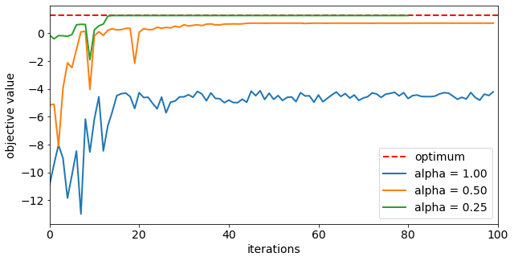

# Improving Variational Quantum Optimization using CVaR

## Introduction

This notebook shows how to use the Conditional Value at Risk (CVaR) objective function introduced in [1] within the variational quantum optimization algorithms provided by Qiskit. Particularly, it is shown how to setup the `MinimumEigenOptimizer` using `VQE` accordingly. 
For a given set of shots with corresponding objective values of the considered optimization problem, the CVaR with confidence level $\alpha \in [0, 1]$ is defined as the average of the $\alpha$ best shots.
Thus, $\alpha = 1$ corresponds to the standard expected value, while $\alpha=0$ corresponds to the minimum of the given shots, and $\alpha \in (0, 1)$ is a tradeoff between focusing on better shots, but still applying some averaging to smoothen the optimization landscape.

## References

[1] [P. Barkoutsos et al., *Improving Variational Quantum Optimization using CVaR,* Quantum 4, 256 (2020).](https://quantum-journal.org/papers/q-2020-04-20-256/)


```python
from qiskit.circuit.library import RealAmplitudes
from qiskit.algorithms.optimizers import COBYLA
from qiskit.algorithms import NumPyMinimumEigensolver, VQE
from qiskit.opflow import PauliExpectation, CVaRExpectation
from qiskit_optimization import QuadraticProgram
from qiskit_optimization.converters import LinearEqualityToPenalty
from qiskit_optimization.algorithms import MinimumEigenOptimizer
from qiskit_optimization.translators import from_docplex_mp
from qiskit import execute, Aer
from qiskit.utils import algorithm_globals

import numpy as np
import matplotlib.pyplot as plt
from docplex.mp.model import Model
```


```python
algorithm_globals.random_seed = 123456
```

## Portfolio Optimization
In the following we define a problem instance for portfolio optimization as introduced in [1].<br>


```python
# prepare problem instance
n = 6  # number of assets
q = 0.5  # risk factor
budget = n // 2  # budget
penalty = 2 * n  # scaling of penalty term
```


```python
# instance from [1]
mu = np.array([0.7313, 0.9893, 0.2725, 0.8750, 0.7667, 0.3622])
sigma = np.array(
    [
        [0.7312, -0.6233, 0.4689, -0.5452, -0.0082, -0.3809],
        [-0.6233, 2.4732, -0.7538, 2.4659, -0.0733, 0.8945],
        [0.4689, -0.7538, 1.1543, -1.4095, 0.0007, -0.4301],
        [-0.5452, 2.4659, -1.4095, 3.5067, 0.2012, 1.0922],
        [-0.0082, -0.0733, 0.0007, 0.2012, 0.6231, 0.1509],
        [-0.3809, 0.8945, -0.4301, 1.0922, 0.1509, 0.8992],
    ]
)

# or create random instance
# mu, sigma = portfolio.random_model(n, seed=123)  # expected returns and covariance matrix
```


```python
# create docplex model
mdl = Model("portfolio_optimization")
x = mdl.binary_var_list(range(n), name="x")
objective = mdl.sum([mu[i] * x[i] for i in range(n)])
objective -= q * mdl.sum([sigma[i, j] * x[i] * x[j] for i in range(n) for j in range(n)])
mdl.maximize(objective)
mdl.add_constraint(mdl.sum(x[i] for i in range(n)) == budget)

# case to
qp = from_docplex_mp(mdl)
```


```python
# solve classically as reference
opt_result = MinimumEigenOptimizer(NumPyMinimumEigensolver()).solve(qp)
print(opt_result.prettyprint())
```

    objective function value: 1.27835
    variable values: x_0=1.0, x_1=1.0, x_2=0.0, x_3=0.0, x_4=1.0, x_5=0.0
    status: SUCCESS


```python
# we convert the problem to an unconstrained problem for further analysis,
# otherwise this would not be necessary as the MinimumEigenSolver would do this
# translation automatically
linear2penalty = LinearEqualityToPenalty(penalty=penalty)
qp = linear2penalty.convert(qp)
_, offset = qp.to_ising()
```

## Minimum Eigen Optimizer using VQE


```python
# set classical optimizer
maxiter = 100
optimizer = COBYLA(maxiter=maxiter)

# set variational ansatz
ansatz = RealAmplitudes(n, reps=1)
m = ansatz.num_parameters

# set backend
backend_name = "qasm_simulator"  # use this for QASM simulator
# backend_name = 'aer_simulator_statevector'  # use this for statevector simlator
backend = Aer.get_backend(backend_name)

# run variational optimization for different values of alpha
alphas = [1.0, 0.50, 0.25]  # confidence levels to be evaluated
```


```python
# dictionaries to store optimization progress and results
objectives = {alpha: [] for alpha in alphas}  # set of tested objective functions w.r.t. alpha
results = {}  # results of minimum eigensolver w.r.t alpha

# callback to store intermediate results
def callback(i, params, obj, stddev, alpha):
    # we translate the objective from the internal Ising representation
    # to the original optimization problem
    objectives[alpha] += [-(obj + offset)]


# loop over all given alpha values
for alpha in alphas:

    # initialize CVaR_alpha objective
    cvar_exp = CVaRExpectation(alpha, PauliExpectation())
    cvar_exp.compute_variance = lambda x: [0]  # to be fixed in PR #1373

    # initialize VQE using CVaR
    vqe = VQE(
        expectation=cvar_exp,
        optimizer=optimizer,
        ansatz=ansatz,
        quantum_instance=backend,
        callback=lambda i, params, obj, stddev: callback(i, params, obj, stddev, alpha),
    )

    # initialize optimization algorithm based on CVaR-VQE
    opt_alg = MinimumEigenOptimizer(vqe)

    # solve problem
    results[alpha] = opt_alg.solve(qp)

    # print results
    print("alpha = {}:".format(alpha))
    print(results[alpha].prettyprint())
    print()
```

    alpha = 1.0:
    objective function value: 0.9716499999999968
    variable values: x_0=1.0, x_1=0.0, x_2=0.0, x_3=0.0, x_4=1.0, x_5=1.0
    status: SUCCESS
    
    alpha = 0.5:
    objective function value: 0.7296000000000049
    variable values: x_0=0.0, x_1=1.0, x_2=1.0, x_3=0.0, x_4=1.0, x_5=0.0
    status: SUCCESS
    
    alpha = 0.25:
    objective function value: 1.2783500000000174
    variable values: x_0=1.0, x_1=1.0, x_2=0.0, x_3=0.0, x_4=1.0, x_5=0.0
    status: SUCCESS
    


```python
# plot resulting history of objective values
plt.figure(figsize=(10, 5))
plt.plot([0, maxiter], [opt_result.fval, opt_result.fval], "r--", linewidth=2, label="optimum")
for alpha in alphas:
    plt.plot(objectives[alpha], label="alpha = %.2f" % alpha, linewidth=2)
plt.legend(loc="lower right", fontsize=14)
plt.xlim(0, maxiter)
plt.xticks(fontsize=14)
plt.xlabel("iterations", fontsize=14)
plt.yticks(fontsize=14)
plt.ylabel("objective value", fontsize=14)
plt.show()
```


    

    


```python
# evaluate and sort all objective values
objective_values = np.zeros(2**n)
for i in range(2**n):
    x_bin = ("{0:0%sb}" % n).format(i)
    x = [0 if x_ == "0" else 1 for x_ in reversed(x_bin)]
    objective_values[i] = qp.objective.evaluate(x)
ind = np.argsort(objective_values)

# evaluate final optimal probability for each alpha
probabilities = np.zeros(len(objective_values))
for alpha in alphas:
    if backend_name == "qasm_simulator":
        counts = results[alpha].min_eigen_solver_result.eigenstate
        shots = sum(counts.values())
        for key, val in counts.items():
            i = int(key, 2)
            probabilities[i] = val / shots
    else:
        probabilities = np.abs(results[alpha].min_eigen_solver_result.eigenstate) ** 2
    print("optimal probabilitiy (alpha = %.2f):  %.4f" % (alpha, probabilities[ind][-1:]))
```

    optimal probabilitiy (alpha = 1.00):  0.0000
    optimal probabilitiy (alpha = 0.50):  0.0000
    optimal probabilitiy (alpha = 0.25):  0.1676


```python
import qiskit.tools.jupyter

%qiskit_version_table
%qiskit_copyright
```


<h3>Version Information</h3><table><tr><th>Qiskit Software</th><th>Version</th></tr><tr><td><code>qiskit-terra</code></td><td>0.22.0</td></tr><tr><td><code>qiskit-aer</code></td><td>0.11.0</td></tr><tr><td><code>qiskit-ignis</code></td><td>0.7.0</td></tr><tr><td><code>qiskit</code></td><td>0.37.1</td></tr><tr><td><code>qiskit-nature</code></td><td>0.4.3</td></tr><tr><td><code>qiskit-finance</code></td><td>0.3.3</td></tr><tr><td><code>qiskit-optimization</code></td><td>0.5.0</td></tr><tr><td><code>qiskit-machine-learning</code></td><td>0.4.0</td></tr><tr><th>System information</th></tr><tr><td>Python version</td><td>3.8.13</td></tr><tr><td>Python compiler</td><td>GCC 10.3.0</td></tr><tr><td>Python build</td><td>default, Mar 25 2022 06:04:10</td></tr><tr><td>OS</td><td>Linux</td></tr><tr><td>CPUs</td><td>12</td></tr><tr><td>Memory (Gb)</td><td>31.267112731933594</td></tr><tr><td colspan='2'>Fri Jul 29 20:01:51 2022 UTC</td></tr></table>


<div style='width: 100%; background-color:#d5d9e0;padding-left: 10px; padding-bottom: 10px; padding-right: 10px; padding-top: 5px'><h3>This code is a part of Qiskit</h3><p>&copy; Copyright IBM 2017, 2022.</p><p>This code is licensed under the Apache License, Version 2.0. You may<br>obtain a copy of this license in the LICENSE.txt file in the root directory<br> of this source tree or at http://www.apache.org/licenses/LICENSE-2.0.<p>Any modifications or derivative works of this code must retain this<br>copyright notice, and modified files need to carry a notice indicating<br>that they have been altered from the originals.</p></div>


```python

```
