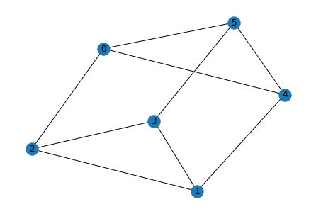
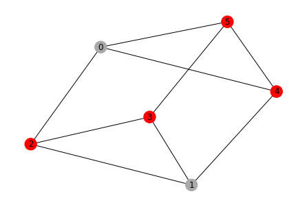
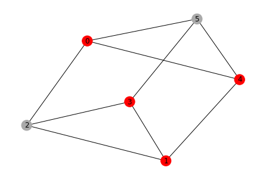

# Application Classes for Optimization Problems

## Introduction

We introduce application classes for the following optimization problems so that users can easily try various optimization problems on quantum computers.

1. Exact cover problem
  - Given a collection of subsets of items, find a subcollection such that each item is covered exactly once.
2. Knapsack problem
  - Given a set of items, find a subset of items such that the total weight is within the capacity and the total value is maximized.
3. Number partition problem
  - Given a multiset of positive integers, find a partition of the multiset into two subsets such that the sums of the subsets are equal.
4. Set packing problem
  - Given a collection of subsets of items, find a subcollection such that all subsets of the subcollection are pairwise disjoint and the number of items in the subcollection is maximized.

Graph problems

5. Clique problem
  - Given an undirected graph, find a subset of nodes with a specified number or the maximum number such that the induced subgraph is complete.
6. Graph partition problem
  - Given an undirected graph, find a partition into two components whose sizes are equal such that the total capacity of the edges between the two components is minimized.
7. Max-cut problem
  - Given an undirected graph, find a partition of nodes into two subsets such that the total weight of the edges between the two subsets is maximized. 
8. Stable set problem
  - Given an undirected graph, find a subset of nodes such that no edge connects the nodes in the subset and the number of nodes is maximized.
9. Traveling salesman problem
  - Given a graph, find a route with the minimum distance such that the route visits each city exactly once.
10. Vehicle routing problem
  - Given a graph, a depot node, and the number of vehicles (routes), find a set of routes such that each node is covered exactly once except the depot and the total distance of the routes is minimized.
11. Vertex cover problem
  - Given an undirected graph, find a subset of nodes with the minimum size such that each edge has at least one endpoint in the subsets.

The application classes for graph problems (`GraphOptimizationApplication`) provide a functionality to draw graphs of an instance and a result.
Note that you need to install `matplotlib` beforehand to utilize the functionality.

We introduce examples of the vertex cover problem and the knapsack problem in this page.

Examples of the max-cut problem and the traveling salesman problem are available in [Max-Cut and Traveling Salesman Problem](06_examples_max_cut_and_tsp.ipynb).

We first import packages necessary for application classes.


```python
from qiskit_optimization.algorithms import MinimumEigenOptimizer
from qiskit import Aer
from qiskit.utils import algorithm_globals, QuantumInstance
from qiskit.algorithms import QAOA, NumPyMinimumEigensolver
```

## Vertex cover problem

We introduce the application class for the vertex cover problem as an example of graph problems.
Given an undirected graph, the vertex cover problem asks us to find a subset of nodes with the minimum size such that all edges are covered by any node selected.

We import the application class `VertexCover` for the vertex cover problem and `networkx` to generate a random graph.


```python
from qiskit_optimization.applications.vertex_cover import VertexCover
import networkx as nx

seed = 123
algorithm_globals.random_seed = seed
qins = QuantumInstance(
    backend=Aer.get_backend("qasm_simulator"), shots=1000, seed_simulator=seed, seed_transpiler=seed
)
```


```python
graph = nx.random_regular_graph(d=3, n=6, seed=seed)
pos = nx.spring_layout(graph, seed=seed)
```


```python
prob = VertexCover(graph)
prob.draw(pos=pos)
```


    

    


`VertexCover` takes a graph as an instance and `to_quadratic_program` generates a corresponding `QuadraticProgram` of the instance of the vertex cover problem.


```python
qp = prob.to_quadratic_program()
print(qp.prettyprint())
```

    Problem name: Vertex cover
    
    Minimize
      x_0 + x_1 + x_2 + x_3 + x_4 + x_5
    
    Subject to
      Linear constraints (9)
        x_1 + x_2 >= 1  'c0'
        x_1 + x_4 >= 1  'c1'
        x_1 + x_3 >= 1  'c2'
        x_2 + x_3 >= 1  'c3'
        x_0 + x_2 >= 1  'c4'
        x_0 + x_4 >= 1  'c5'
        x_0 + x_5 >= 1  'c6'
        x_4 + x_5 >= 1  'c7'
        x_3 + x_5 >= 1  'c8'
    
      Binary variables (6)
        x_0 x_1 x_2 x_3 x_4 x_5
    


You can solve the problem as follows. `NumPyMinimumEigensolver` finds the minimum eigen vector. You can also apply QAOA. Note that the solution by QAOA is not always optimal.


```python
# Numpy Eigensolver
meo = MinimumEigenOptimizer(min_eigen_solver=NumPyMinimumEigensolver())
result = meo.solve(qp)
print(result.prettyprint())
print("\nsolution:", prob.interpret(result))
prob.draw(result, pos=pos)
```

    objective function value: 4.0
    variable values: x_0=0.0, x_1=0.0, x_2=1.0, x_3=1.0, x_4=1.0, x_5=1.0
    status: SUCCESS
    
    solution: [2, 3, 4, 5]


    

    


```python
# QAOA
meo = MinimumEigenOptimizer(min_eigen_solver=QAOA(reps=1, quantum_instance=qins))
result = meo.solve(qp)
print(result.prettyprint())
print("\nsolution:", prob.interpret(result))
print("\ntime:", result.min_eigen_solver_result.optimizer_time)
prob.draw(result, pos=pos)
```

    objective function value: 4.0
    variable values: x_0=1.0, x_1=1.0, x_2=0.0, x_3=1.0, x_4=1.0, x_5=0.0
    status: SUCCESS
    
    solution: [0, 1, 3, 4]
    
    time: 0.05200529098510742


    

    


## Knapsack problem

The knapsack problem asks us to find a combination of items such that the total weight is within the capacity of the knapsack and maximize the total value of the items.
The following examples solve an instance of the knapsack problem with 5 items by Numpy eigensolver and QAOA.


```python
from qiskit_optimization.applications import Knapsack
```


```python
prob = Knapsack(values=[3, 4, 5, 6, 7], weights=[2, 3, 4, 5, 6], max_weight=10)
qp = prob.to_quadratic_program()
print(qp.prettyprint())
```

    Problem name: Knapsack
    
    Maximize
      3*x_0 + 4*x_1 + 5*x_2 + 6*x_3 + 7*x_4
    
    Subject to
      Linear constraints (1)
        2*x_0 + 3*x_1 + 4*x_2 + 5*x_3 + 6*x_4 <= 10  'c0'
    
      Binary variables (5)
        x_0 x_1 x_2 x_3 x_4
    


```python
# Numpy Eigensolver
meo = MinimumEigenOptimizer(min_eigen_solver=NumPyMinimumEigensolver())
result = meo.solve(qp)
print(result.prettyprint())
print("\nsolution:", prob.interpret(result))
```

    objective function value: 13.0
    variable values: x_0=1.0, x_1=1.0, x_2=0.0, x_3=1.0, x_4=0.0
    status: SUCCESS
    
    solution: [0, 1, 3]


```python
# QAOA
meo = MinimumEigenOptimizer(min_eigen_solver=QAOA(reps=1, quantum_instance=qins))
result = meo.solve(qp)
print(result.prettyprint())
print("\nsolution:", prob.interpret(result))
print("\ntime:", result.min_eigen_solver_result.optimizer_time)
```

    objective function value: 13.0
    variable values: x_0=1.0, x_1=1.0, x_2=0.0, x_3=1.0, x_4=0.0
    status: SUCCESS
    
    solution: [0, 1, 3]
    
    time: 2.000196933746338


## How to check the Hamiltonian

If you want to check the actual Hamiltonian generated from your problem instance, you need to apply a converter as follows.


```python
from qiskit_optimization.converters import QuadraticProgramToQubo
```


```python
# the same knapsack problem instance as in the previous section
prob = Knapsack(values=[3, 4, 5, 6, 7], weights=[2, 3, 4, 5, 6], max_weight=10)
qp = prob.to_quadratic_program()
print(qp.prettyprint())
```

    Problem name: Knapsack
    
    Maximize
      3*x_0 + 4*x_1 + 5*x_2 + 6*x_3 + 7*x_4
    
    Subject to
      Linear constraints (1)
        2*x_0 + 3*x_1 + 4*x_2 + 5*x_3 + 6*x_4 <= 10  'c0'
    
      Binary variables (5)
        x_0 x_1 x_2 x_3 x_4
    


```python
# intermediate QUBO form of the optimization problem
conv = QuadraticProgramToQubo()
qubo = conv.convert(qp)
print(qubo.prettyprint())
```

    Problem name: Knapsack
    
    Minimize
      26*c0@int_slack@0^2 + 104*c0@int_slack@0*c0@int_slack@1
      + 208*c0@int_slack@0*c0@int_slack@2 + 156*c0@int_slack@0*c0@int_slack@3
      + 104*c0@int_slack@1^2 + 416*c0@int_slack@1*c0@int_slack@2
      + 312*c0@int_slack@1*c0@int_slack@3 + 416*c0@int_slack@2^2
      + 624*c0@int_slack@2*c0@int_slack@3 + 234*c0@int_slack@3^2
      + 104*x_0*c0@int_slack@0 + 208*x_0*c0@int_slack@1 + 416*x_0*c0@int_slack@2
      + 312*x_0*c0@int_slack@3 + 104*x_0^2 + 312*x_0*x_1 + 416*x_0*x_2 + 520*x_0*x_3
      + 624*x_0*x_4 + 156*x_1*c0@int_slack@0 + 312*x_1*c0@int_slack@1
      + 624*x_1*c0@int_slack@2 + 468*x_1*c0@int_slack@3 + 234*x_1^2 + 624*x_1*x_2
      + 780*x_1*x_3 + 936*x_1*x_4 + 208*x_2*c0@int_slack@0 + 416*x_2*c0@int_slack@1
      + 832*x_2*c0@int_slack@2 + 624*x_2*c0@int_slack@3 + 416*x_2^2 + 1040*x_2*x_3
      + 1248*x_2*x_4 + 260*x_3*c0@int_slack@0 + 520*x_3*c0@int_slack@1
      + 1040*x_3*c0@int_slack@2 + 780*x_3*c0@int_slack@3 + 650*x_3^2 + 1560*x_3*x_4
      + 312*x_4*c0@int_slack@0 + 624*x_4*c0@int_slack@1 + 1248*x_4*c0@int_slack@2
      + 936*x_4*c0@int_slack@3 + 936*x_4^2 - 520*c0@int_slack@0
      - 1040*c0@int_slack@1 - 2080*c0@int_slack@2 - 1560*c0@int_slack@3 - 1043*x_0
      - 1564*x_1 - 2085*x_2 - 2606*x_3 - 3127*x_4 + 2600
    
    Subject to
      No constraints
    
      Binary variables (9)
        x_0 x_1 x_2 x_3 x_4 c0@int_slack@0 c0@int_slack@1 c0@int_slack@2
        c0@int_slack@3
    


```python
# qubit Hamiltonian and offset
op, offset = qubo.to_ising()
print(f"num qubits: {op.num_qubits}, offset: {offset}\n")
print(op)
```

    num qubits: 9, offset: 1417.5
    
    -258.5 * IIIIIIIIZ
    - 388.0 * IIIIIIIZI
    - 517.5 * IIIIIIZII
    - 647.0 * IIIIIZIII
    - 776.5 * IIIIZIIII
    - 130.0 * IIIZIIIII
    - 260.0 * IIZIIIIII
    - 520.0 * IZIIIIIII
    - 390.0 * ZIIIIIIII
    + 78.0 * IIIIIIIZZ
    + 104.0 * IIIIIIZIZ
    + 156.0 * IIIIIIZZI
    + 130.0 * IIIIIZIIZ
    + 195.0 * IIIIIZIZI
    + 260.0 * IIIIIZZII
    + 156.0 * IIIIZIIIZ
    + 234.0 * IIIIZIIZI
    + 312.0 * IIIIZIZII
    + 390.0 * IIIIZZIII
    + 26.0 * IIIZIIIIZ
    + 39.0 * IIIZIIIZI
    + 52.0 * IIIZIIZII
    + 65.0 * IIIZIZIII
    + 78.0 * IIIZZIIII
    + 52.0 * IIZIIIIIZ
    + 78.0 * IIZIIIIZI
    + 104.0 * IIZIIIZII
    + 130.0 * IIZIIZIII
    + 156.0 * IIZIZIIII
    + 26.0 * IIZZIIIII
    + 104.0 * IZIIIIIIZ
    + 156.0 * IZIIIIIZI
    + 208.0 * IZIIIIZII
    + 260.0 * IZIIIZIII
    + 312.0 * IZIIZIIII
    + 52.0 * IZIZIIIII
    + 104.0 * IZZIIIIII
    + 78.0 * ZIIIIIIIZ
    + 117.0 * ZIIIIIIZI
    + 156.0 * ZIIIIIZII
    + 195.0 * ZIIIIZIII
    + 234.0 * ZIIIZIIII
    + 39.0 * ZIIZIIIII
    + 78.0 * ZIZIIIIII
    + 156.0 * ZZIIIIIII


```python
import qiskit.tools.jupyter

%qiskit_version_table
%qiskit_copyright
```


<h3>Version Information</h3><table><tr><th>Qiskit Software</th><th>Version</th></tr><tr><td><code>qiskit-terra</code></td><td>0.22.0</td></tr><tr><td><code>qiskit-aer</code></td><td>0.11.0</td></tr><tr><td><code>qiskit-ignis</code></td><td>0.7.0</td></tr><tr><td><code>qiskit</code></td><td>0.37.1</td></tr><tr><td><code>qiskit-nature</code></td><td>0.4.3</td></tr><tr><td><code>qiskit-finance</code></td><td>0.3.3</td></tr><tr><td><code>qiskit-optimization</code></td><td>0.5.0</td></tr><tr><td><code>qiskit-machine-learning</code></td><td>0.4.0</td></tr><tr><th>System information</th></tr><tr><td>Python version</td><td>3.8.13</td></tr><tr><td>Python compiler</td><td>GCC 10.3.0</td></tr><tr><td>Python build</td><td>default, Mar 25 2022 06:04:10</td></tr><tr><td>OS</td><td>Linux</td></tr><tr><td>CPUs</td><td>12</td></tr><tr><td>Memory (Gb)</td><td>31.267112731933594</td></tr><tr><td colspan='2'>Fri Jul 29 20:02:40 2022 UTC</td></tr></table>


<div style='width: 100%; background-color:#d5d9e0;padding-left: 10px; padding-bottom: 10px; padding-right: 10px; padding-top: 5px'><h3>This code is a part of Qiskit</h3><p>&copy; Copyright IBM 2017, 2022.</p><p>This code is licensed under the Apache License, Version 2.0. You may<br>obtain a copy of this license in the LICENSE.txt file in the root directory<br> of this source tree or at http://www.apache.org/licenses/LICENSE-2.0.<p>Any modifications or derivative works of this code must retain this<br>copyright notice, and modified files need to carry a notice indicating<br>that they have been altered from the originals.</p></div>

