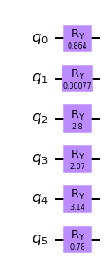
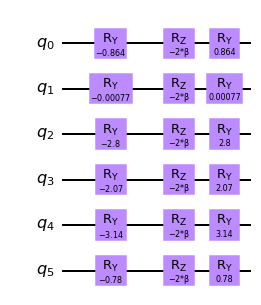

# Warm-starting quantum optimization

## Introduction

Optimization problems with integer variables or constraints are often hard to solve. For example, the Quadratic Unconstrained Binary Optimization (QUBO) problem, i.e.

\begin{align}
\min_{x\in\{0,1\}^n}x^T\Sigma x + \mu^Tx,
\end{align}

is NP-Hard. Here, $\Sigma$ is an $n\times n$ matrix and $x$ is a vector of $n$ binary variables. Note that we could have added the linear term $\mu$ to the diagonal as $x_i^2=x_i$ for $x_i\in\{0, 1\}$. While QUBOs are hard to solve there exists many ways to relax them to problems that are easier to solve.
For example, if $\Sigma$ is semi-definite positive the QUBO can be relaxed and results in a convex Quadratic Program 

\begin{align}
\min_{x\in[0,1]^n}x^T\Sigma x,
\end{align}

which becomes easy to solve as $x$ now represents $n$ continuous variables bound to the range $[0, 1]$.
Such relaxations can be leveraged to warm-start quantum optimization algorithms as shown in [1].

## References

[1] [D. J. Egger, J Marecek, S. Woerner, *Warm-starting quantum optimization*, arXiv:2009.10095](http://arxiv.org/abs/2009.10095)


```python
import numpy as np
import copy

# Problem modelling imports
from docplex.mp.model import Model

# Qiskit imports
from qiskit import BasicAer
from qiskit.utils import QuantumInstance
from qiskit.algorithms import QAOA, NumPyMinimumEigensolver
from qiskit.utils.algorithm_globals import algorithm_globals
from qiskit_optimization.algorithms import MinimumEigenOptimizer, CplexOptimizer
from qiskit_optimization import QuadraticProgram
from qiskit_optimization.problems.variable import VarType
from qiskit_optimization.converters.quadratic_program_to_qubo import QuadraticProgramToQubo
from qiskit_optimization.translators import from_docplex_mp
```

## Preliminaries: relaxing QUBOs

First, we show how to relax a QUBO built with a semi-definite positive matrix to obtain an easy-to-solve QP.


```python
def create_problem(mu: np.array, sigma: np.array, total: int = 3) -> QuadraticProgram:
    """Solve the quadratic program using docplex."""

    mdl = Model()
    x = [mdl.binary_var("x%s" % i) for i in range(len(sigma))]

    objective = mdl.sum([mu[i] * x[i] for i in range(len(mu))])
    objective -= 2 * mdl.sum(
        [sigma[i, j] * x[i] * x[j] for i in range(len(mu)) for j in range(len(mu))]
    )
    mdl.maximize(objective)
    cost = mdl.sum(x)
    mdl.add_constraint(cost == total)

    qp = from_docplex_mp(mdl)
    return qp


def relax_problem(problem) -> QuadraticProgram:
    """Change all variables to continuous."""
    relaxed_problem = copy.deepcopy(problem)
    for variable in relaxed_problem.variables:
        variable.vartype = VarType.CONTINUOUS

    return relaxed_problem
```

For this example, we use a positive semi-definite matrix $\Sigma$ and a linear term $\mu$ as defined below.


```python
mu = np.array([3.418, 2.0913, 6.2415, 4.4436, 10.892, 3.4051])
sigma = np.array(
    [
        [1.07978412, 0.00768914, 0.11227606, -0.06842969, -0.01016793, -0.00839765],
        [0.00768914, 0.10922887, -0.03043424, -0.0020045, 0.00670929, 0.0147937],
        [0.11227606, -0.03043424, 0.985353, 0.02307313, -0.05249785, 0.00904119],
        [-0.06842969, -0.0020045, 0.02307313, 0.6043817, 0.03740115, -0.00945322],
        [-0.01016793, 0.00670929, -0.05249785, 0.03740115, 0.79839634, 0.07616951],
        [-0.00839765, 0.0147937, 0.00904119, -0.00945322, 0.07616951, 1.08464544],
    ]
)
```

Using DOCPLEX we build a model with binary variables.


```python
qubo = create_problem(mu, sigma)
print(qubo.prettyprint())
```

    Problem name: docplex_model1
    
    Maximize
      -2.15956824*x0^2 - 0.03075656*x0*x1 - 0.44910424*x0*x2 + 0.27371876*x0*x3
      + 0.04067172*x0*x4 + 0.0335906*x0*x5 - 0.21845774*x1^2 + 0.12173696*x1*x2
      + 0.008018*x1*x3 - 0.02683716*x1*x4 - 0.0591748*x1*x5 - 1.970706*x2^2
      - 0.09229252*x2*x3 + 0.2099914*x2*x4 - 0.03616476*x2*x5 - 1.2087634*x3^2
      - 0.1496046*x3*x4 + 0.03781288*x3*x5 - 1.59679268*x4^2 - 0.30467804*x4*x5
      - 2.16929088*x5^2 + 3.418*x0 + 2.0913*x1 + 6.2415*x2 + 4.4436*x3 + 10.892*x4
      + 3.4051*x5
    
    Subject to
      Linear constraints (1)
        x0 + x1 + x2 + x3 + x4 + x5 == 3  'c0'
    
      Binary variables (6)
        x0 x1 x2 x3 x4 x5
    


Such binary problems are hard to deal with but can be solved if the problem instance is small enough. Our example above has as solution


```python
result = CplexOptimizer().solve(qubo)
print(result.prettyprint())
```

    objective function value: 16.7689322
    variable values: x0=0.0, x1=0.0, x2=1.0, x3=1.0, x4=1.0, x5=0.0
    status: SUCCESS


We can create a relaxation of this problem in which the variables are no longer binary. Note that we use the `QuadraticProgramToQubo` converter to convert the constraint into a quadratic penalty term. We do this to remain consistent with the steps that the Qiskit optimization module applies internally. 


```python
qp = relax_problem(QuadraticProgramToQubo().convert(qubo))
print(qp.prettyprint())
```

    Problem name: docplex_model1
    
    Minimize
      44.848800180000005*x0^2 + 85.40922044000001*x0*x1 + 85.82756812000001*x0*x2
      + 85.10474512000002*x0*x3 + 85.33779216000002*x0*x4 + 85.34487328000002*x0*x5
      + 42.907689680000004*x1^2 + 85.25672692*x1*x2 + 85.37044588*x1*x3
      + 85.40530104000001*x1*x4 + 85.43763868000002*x1*x5 + 44.659937940000006*x2^2
      + 85.47075640000001*x2*x3 + 85.16847248000002*x2*x4 + 85.41462864000002*x2*x5
      + 43.89799534000001*x3^2 + 85.52806848000002*x3*x4 + 85.34065100000001*x3*x5
      + 44.286024620000006*x4^2 + 85.68314192000001*x4*x5 + 44.858522820000005*x5^2
      - 259.55339164000003*x0 - 258.22669164*x1 - 262.37689164*x2 - 260.57899164*x3
      - 267.02739164*x4 - 259.54049164*x5 + 384.20308746000006
    
    Subject to
      No constraints
    
      Continuous variables (6)
        0 <= x0 <= 1
        0 <= x1 <= 1
        0 <= x2 <= 1
        0 <= x3 <= 1
        0 <= x4 <= 1
        0 <= x5 <= 1
    


The solution of this continuous relaxation is different from the solution to the binary problem but can be used to warm-start a solver when dealing with the binary problem.


```python
sol = CplexOptimizer().solve(qp)
print(sol.prettyprint())
```

    objective function value: -17.012055025682855
    variable values: x0=0.1752499576180142, x1=1.4803888163988428e-07, x2=0.9709053264087596, x3=0.7384168677494174, x4=0.9999999916475085, x5=0.14438904470168756
    status: SUCCESS


```python
c_stars = sol.samples[0].x
print(c_stars)
```

    [0.1752499576180142, 1.4803888163988428e-07, 0.9709053264087596, 0.7384168677494174, 0.9999999916475085, 0.14438904470168756]


## QAOA

Here, we illustrate how to warm-start the quantum approximate optimization algorithm (QAOA) by leveraging the relaxed problem shown above. 

### Standard QAOA

First, we use standard QAOA to solve the QUBO. To do this, we convert the QUBO to Qiskit's QuadraticProgram class (note that the resulting problem is still a binary problem).


```python
algorithm_globals.random_seed = 12345
quantum_instance = QuantumInstance(
    BasicAer.get_backend("statevector_simulator"),
    seed_simulator=algorithm_globals.random_seed,
    seed_transpiler=algorithm_globals.random_seed,
)
qaoa_mes = QAOA(quantum_instance=quantum_instance, initial_point=[0.0, 1.0])
exact_mes = NumPyMinimumEigensolver()
```


```python
qaoa = MinimumEigenOptimizer(qaoa_mes)
```


```python
qaoa_result = qaoa.solve(qubo)
print(qaoa_result.prettyprint())
```

    objective function value: 16.768932200000002
    variable values: x0=0.0, x1=0.0, x2=1.0, x3=1.0, x4=1.0, x5=0.0
    status: SUCCESS


### Warm-start QAOA

Next, we compare this result to a warm-start QAOA in which we use the solution to the continuous relaxation of the problem. First, we create the initial state 

\begin{align}
|\phi^*\rangle=\bigotimes_{i=0}^{n-1}R_y(\theta_i)|0\rangle_n .
\end{align}

which is given by applying $R_y$ rotations with an angle $\theta=2\arcsin(\sqrt{c^*_i})$ that depends on the solution to the relaxed problem.
Here, $c^*_i$ the value of variable $i$ of the relaxed problem.


```python
from qiskit import QuantumCircuit

thetas = [2 * np.arcsin(np.sqrt(c_star)) for c_star in c_stars]

init_qc = QuantumCircuit(len(sigma))
for idx, theta in enumerate(thetas):
    init_qc.ry(theta, idx)

init_qc.draw(output="mpl")
```


    

    


Next, we create the mixer operator for QAOA. When warm-starting QAOA we must ensure that the mixer operator has the initial state as ground state. We therefore chose the Hamiltonian

\begin{align}
H_{M,i}^{(ws)}=
\begin{pmatrix}
2c_i^*-1 & -2\sqrt{c_i^*(1-c_i^*)} \\
-2\sqrt{c_i^*(1-c_i^*)} & 1-2c_i^*
\end{pmatrix}
\end{align}

as mixer operator for qubit $i$. Once multiplied by $-i\beta$ and exponentiated this mixer produces the following mixer circuit.


```python
from qiskit.circuit import Parameter

beta = Parameter("β")

ws_mixer = QuantumCircuit(len(sigma))
for idx, theta in enumerate(thetas):
    ws_mixer.ry(-theta, idx)
    ws_mixer.rz(-2 * beta, idx)
    ws_mixer.ry(theta, idx)

ws_mixer.draw(output="mpl")
```


    

    


The initial state and mixer operator can then be passed to QAOA.


```python
ws_qaoa_mes = QAOA(
    quantum_instance=quantum_instance,
    initial_state=init_qc,
    mixer=ws_mixer,
    initial_point=[0.0, 1.0],
)
```


```python
ws_qaoa = MinimumEigenOptimizer(ws_qaoa_mes)
```


```python
ws_qaoa_result = ws_qaoa.solve(qubo)
print(ws_qaoa_result.prettyprint())
```

    objective function value: 16.768932200000002
    variable values: x0=0.0, x1=0.0, x2=1.0, x3=1.0, x4=1.0, x5=0.0
    status: SUCCESS


### Analysis

Both results appear to give the same result. However, when we look at the underlying probability distribution we observe that the warm-start QAOA has a much higher probability of sampling the optimal solution.


```python
def format_qaoa_samples(samples, max_len: int = 10):
    qaoa_res = []
    for s in samples:
        if sum(s.x) == 3:
            qaoa_res.append(("".join([str(int(_)) for _ in s.x]), s.fval, s.probability))

    res = sorted(qaoa_res, key=lambda x: -x[1])[0:max_len]

    return [(_[0] + f": value: {_[1]:.3f}, probability: {1e2*_[2]:.1f}%") for _ in res]


format_qaoa_samples(qaoa_result.samples)
```


    ['001110: value: 16.769, probability: 0.9%',
     '011010: value: 15.744, probability: 0.1%',
     '001011: value: 14.671, probability: 4.1%',
     '101010: value: 14.626, probability: 2.5%',
     '010110: value: 14.234, probability: 0.2%',
     '100110: value: 13.953, probability: 0.2%',
     '000111: value: 13.349, probability: 0.6%',
     '110010: value: 12.410, probability: 1.7%',
     '010011: value: 12.013, probability: 0.0%',
     '100011: value: 11.559, probability: 5.5%']


```python
format_qaoa_samples(ws_qaoa_result.samples)
```


    ['001110: value: 16.769, probability: 48.4%',
     '001011: value: 14.671, probability: 3.4%',
     '101010: value: 14.626, probability: 4.5%',
     '100110: value: 13.953, probability: 0.6%',
     '000111: value: 13.349, probability: 0.4%',
     '100011: value: 11.559, probability: 0.1%']


## Warm-start QAOA

The warm-start features above are available in the Qiskit optimization module as a single optimizer named `WarmStartQAOAOptimizer` which is illustrated below. This solver will solve a QUBO with a warm-start QAOA. It computes $c^*$ by relaxing the problem. This behavior is controlled by setting `relax_for_pre_solver` to `True`.


```python
from qiskit_optimization.algorithms import WarmStartQAOAOptimizer
```


```python
qaoa_mes = QAOA(quantum_instance=quantum_instance, initial_point=[0.0, 1.0])
ws_qaoa = WarmStartQAOAOptimizer(
    pre_solver=CplexOptimizer(), relax_for_pre_solver=True, qaoa=qaoa_mes, epsilon=0.0
)
```


```python
ws_result = ws_qaoa.solve(qubo)
print(ws_result.prettyprint())
```

    objective function value: 16.768932200000002
    variable values: x0=0.0, x1=0.0, x2=1.0, x3=1.0, x4=1.0, x5=0.0
    status: SUCCESS


```python
format_qaoa_samples(ws_result.samples)
```


    ['001110: value: 16.769, probability: 48.4%',
     '001011: value: 14.671, probability: 3.4%',
     '101010: value: 14.626, probability: 4.5%',
     '100110: value: 13.953, probability: 0.6%',
     '000111: value: 13.349, probability: 0.4%',
     '100011: value: 11.559, probability: 0.1%']


```python
import qiskit.tools.jupyter

%qiskit_version_table
%qiskit_copyright
```


<h3>Version Information</h3><table><tr><th>Qiskit Software</th><th>Version</th></tr><tr><td><code>qiskit-terra</code></td><td>0.22.0</td></tr><tr><td><code>qiskit-aer</code></td><td>0.11.0</td></tr><tr><td><code>qiskit-ignis</code></td><td>0.7.0</td></tr><tr><td><code>qiskit</code></td><td>0.37.1</td></tr><tr><td><code>qiskit-nature</code></td><td>0.4.3</td></tr><tr><td><code>qiskit-finance</code></td><td>0.3.3</td></tr><tr><td><code>qiskit-optimization</code></td><td>0.5.0</td></tr><tr><td><code>qiskit-machine-learning</code></td><td>0.4.0</td></tr><tr><th>System information</th></tr><tr><td>Python version</td><td>3.8.13</td></tr><tr><td>Python compiler</td><td>GCC 10.3.0</td></tr><tr><td>Python build</td><td>default, Mar 25 2022 06:04:10</td></tr><tr><td>OS</td><td>Linux</td></tr><tr><td>CPUs</td><td>12</td></tr><tr><td>Memory (Gb)</td><td>31.267112731933594</td></tr><tr><td colspan='2'>Fri Jul 29 20:04:04 2022 UTC</td></tr></table>


<div style='width: 100%; background-color:#d5d9e0;padding-left: 10px; padding-bottom: 10px; padding-right: 10px; padding-top: 5px'><h3>This code is a part of Qiskit</h3><p>&copy; Copyright IBM 2017, 2022.</p><p>This code is licensed under the Apache License, Version 2.0. You may<br>obtain a copy of this license in the LICENSE.txt file in the root directory<br> of this source tree or at http://www.apache.org/licenses/LICENSE-2.0.<p>Any modifications or derivative works of this code must retain this<br>copyright notice, and modified files need to carry a notice indicating<br>that they have been altered from the originals.</p></div>


```python

```
