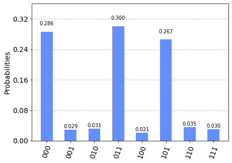
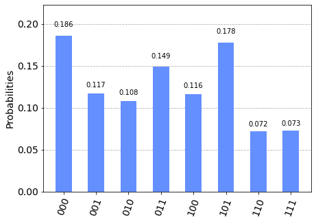

# Solving Satisfiability Problems using Grover's Algorithm

In this section, we demonstrate how to solve satisfiability problems using the implementation of Grover's algorithm in Qiskit Aqua. 

## Contents

1. [Introduction](#introduction)
2. [3-Satisfiability Problem](#3satproblem)
3. [Qiskit Implementation](#implementation)
4. [Problems](#problems)
5. [References](#references)

## 1. Introduction <a id='introduction'></a>

Grover's algorithm for unstructured search was introduced in an [earlier section](https://qiskit.org/textbook/ch-algorithms/grover.html), with an example and implementation using Qiskit Terra. We saw that Grover search is a quantum algorithm that can be used to search for solutions to unstructured problems quadratically faster than its classical counterparts. Here, we are going to illustrate the use of Grover's algorithm to solve a particular combinatorial Boolean satisfiability problem.

In computer science, the Boolean satisfiability problem is the problem of determining if there exists an interpretation that satisfies a given Boolean formula. In other words, it asks whether the variables of a given Boolean formula can be consistently replaced by the values TRUE or FALSE in such a way that the formula evaluates to TRUE. If this is the case, the formula is called satisfiable. On the other hand, if no such assignment exists, the function expressed by the formula is FALSE for all possible variable assignments and the formula is unsatisfiable. This can be seen as a search problem, where the solution is the assignment where the Boolean formula is satisfied.

For _unstructured_ search problems, Grover’s algorithm is optimal with its run time of $O(\sqrt{N}) = O(2^{n/2}) = O(1.414^n)$[2]. In this chapter, we will look at solving a specific Boolean satisfiability problem (3-Satisfiability) using Grover’s algorithm, with the aforementioned run time of $O(1.414^n)$. Interestingly, at the time of writing, the best-known classical algorithm for 3-Satisfiability has an upper-bound of $O(1.307^n)$[3]. You may have heard that Grover’s algorithm can be used to speed up solutions to NP-complete problems, but these NP-complete problems do actually contain structure[4] and we can sometimes do better than the $O(1.414^n)$ of Grover’s algorithm.

While it doesn’t make sense to use Grover’s algorithm on 3-sat problems, the techniques here can be applied to the more general case (k-SAT, discussed in the next section) for which Grover’s algorithm can outperform the best classical algorithm. Additionally, the techniques in Grover’s algorithm can theoretically be combined with the techniques used in the classical algorithms to gain an even better run time than either individually (including with 3-SAT). 

## 2. 3-Satisfiability Problem  <a id='3satproblem'></a>

The 3-Satisfiability (3SAT) Problem is best explained with the following concrete problem. Let us consider a Boolean function $f$ with three Boolean variables $v_1,v_2,v_3$ as below:


$$f(v_1,v_2,v_3) = (\neg v_1 \vee \neg v_2 \vee \neg v_3) \wedge (v_1 \vee \neg v_2 \vee v_3) \wedge (v_1 \vee v_2 \vee \neg v_3) \wedge (v_1 \vee \neg v_2 \vee \neg v_3) \wedge (\neg v_1 \vee v_2 \vee v_3)$$


In the above function, the terms on the right-hand side equation which are inside $()$ are called clauses; this function has 5 clauses. In a k-SAT problem, each clause has exactly k literals; our problem is a 3-SAT problem, so each clause has exactly three literals. For instance, the first clause has $\neg v_1$, $\neg v_2$ and $\neg v_3$ as its literals. The symbol $\neg$ is the Boolean NOT that negates (or, flips) the value of its succeeding literal. The symbols $\vee$ and $\wedge$ are, respectively, the Boolean OR and AND. The Boolean $f$ is satisfiable if there is an assignment of $v_1, v_2, v_3$ that evaluates to $f(v_1, v_2, v_3) = 1$ (that is, $f$ evaluates to True).

A naive way to find such an assignment is by trying every possible combinations of input values of $f$. Below is the table obtained from trying all possible combinations of $v_1, v_2, v_3$. For ease of explanation, we interchangeably use $0$ and False, as well as $1$ and True.  

|$v_1$ | $v_2$ | $v_3$ | $f$ | Comment | 
|------|-------|-------|-----|---------|
| 0    |  0    |  0    |  1  | **Solution** | 
| 0    |  0    |  1    |  0  | Not a solution because $f$ is False | 
| 0    |  1    |  0    |  0  | Not a solution because $f$ is False | 
| 0    |  1    |  1    |  0  | Not a solution because $f$ is False | 
| 1    |  0    |  0    |  0  | Not a solution because $f$ is False | 
| 1    |  0    |  1    |  1  | **Solution** | 
| 1    |  1    |  0    |  1  | **Solution** | 
| 1    |  1    |  1    |  0  | Not a solution because $f$ is False | 

From the table above, we can see that this 3-SAT problem instance has three satisfying solutions: $(v_1, v_2, v_3) = (T, F, T)$ or $(F, F, F)$ or $(T, T, F)$. 

In general, the Boolean function $f$ can have many clauses and more Boolean variables. Note that SAT problems can be always written in what is known as conjunctive normal form (CNF), that is, a conjunction of one or more clauses, where a clause is a disjunction of three literals; otherwise put, it is an AND of k ORs.

## 3. Qiskit Implementation <a id='implementation'></a>

Let's now use Qiskit Aqua to solve the example 3SAT problem: 


$$f(v_1,v_2,v_3) = (\neg v_1 \vee \neg v_2 \vee \neg v_3) \wedge (v_1 \vee \neg v_2 \vee v_3) \wedge (v_1 \vee v_2 \vee \neg v_3) \wedge (v_1 \vee \neg v_2 \vee \neg v_3) \wedge (\neg v_1 \vee v_2 \vee v_3)$$


First we need to understand the input [DIMACS CNF](http://www.satcompetition.org/2009/format-benchmarks2009.html) format that Qiskit Aqua uses for such problem, which looks like the following for the problem:
	
~~~
c example DIMACS CNF 3-SAT
p cnf 3 5
-1 -2 -3 0
1 -2 3 0
1 2 -3 0
1 -2 -3 0
-1 2 3 0
~~~

- Lines that start with `c` are comments
    - eg. `c example DIMACS CNF 3-SAT`
- The first non-comment line needs to be of the form `p cnf nbvar nbclauses`, where
  - `cnf` indicates that the input is in CNF format
  - `nbvar` is the exact number of variables appearing in the file
  - `nbclauses` is the exact number of clauses contained in the file
  - eg. `p cnf 3 5`
- Then there is a line for each clause, where 
  - each clause is a sequence of distinct non-null numbers between `-nbvar` and `nbvar` ending with `0` on the same line
  - it cannot contain the opposite literals i and -i simultaneously
  - positive numbers denote the corresponding variables
  - negative numbers denote the negations of the corresponding variables
  - eg. `-1 2 3 0` corresponds to the clause $\neg v_1 \vee v_2 \vee v_3$

Similarly the solutions to the problem  $(v_1, v_2, v_3) = (T, F, T)$ or $(F, F, F)$ or $(T, T, F)$ can be written as `1 -2 3`, or `-1 -2 -3`, or `1 2 -3`.

With this example problem input, we create the corresponding oracle for our Grover search. In particular, we use the LogicalExpressionOracle component provided by Qiskit, which supports parsing DIMACS CNF format strings and constructing the corresponding oracle circuit.


```python
import numpy as np
from qiskit import Aer
from qiskit.visualization import plot_histogram
from qiskit.utils import QuantumInstance
from qiskit.algorithms import Grover, AmplificationProblem
from qiskit.circuit.library import PhaseOracle
```

We have a DIMACS file saved to the relative path `examples/3sat.dimacs`, let's open it and see what it looks like:


```python
with open('examples/3sat.dimacs', 'r') as f:
    dimacs = f.read()
print(dimacs)
```

    c example DIMACS-CNF 3-SAT
    p cnf 3 5
    -1 -2 -3 0
    1 -2 3 0
    1 2 -3 0
    1 -2 -3 0
    -1 2 3 0


We can now use `PhaseOracle` to create an oracle circuit from this file:


```python
oracle = PhaseOracle.from_dimacs_file('examples/3sat.dimacs')
oracle.draw()
```


<pre style="word-wrap: normal;white-space: pre;background: #fff0;line-height: 1.1;font-family: &quot;Courier New&quot;,Courier,monospace">                          
q_0: ─o───────o───────────
      │ ┌───┐ │ ┌───┐┌───┐
q_1: ─■─┤ X ├─■─┤ X ├┤ Z ├
      │ ├───┤   └───┘└───┘
q_2: ─o─┤ Z ├─────────────
        └───┘             </pre>


Finally, we need a way of checking if the Grover circuit has produced the correct answer. To work with Qiskit's built-in tools, the callable needs to take a measurement string (e.g. `11010011`) and return `True` if it's a correct solution, or `False` otherwise. Below is a simple class that does this:


```python
class Verifier():
    """Create an object that can be used to check whether
    an assignment satisfies a DIMACS file.
        Args:
            dimacs_file (str): path to the DIMACS file
    """
    def __init__(self, dimacs_file):
        with open(dimacs_file, 'r') as f:
            self.dimacs = f.read()

    def is_correct(self, guess):
        """Verifies a SAT solution against this object's
        DIMACS file.
            Args:
                guess (str): Assignment to be verified.
                             Must be string of 1s and 0s.
            Returns:
                bool: True if `guess` satisfies the
                           problem. False otherwise.
        """
        # Convert characters to bools & reverse
        guess = [bool(int(x)) for x in guess][::-1]
        for line in self.dimacs.split('\n'):
            line = line.strip(' 0')
            clause_eval = False
            for literal in line.split(' '):
                if literal in ['p', 'c']:
                    # line is not a clause
                    clause_eval = True
                    break
                if '-' in literal:
                    literal = literal.strip('-')
                    lit_eval = not guess[int(literal)-1]
                else:
                    lit_eval = guess[int(literal)-1]
                clause_eval |= lit_eval
            if clause_eval is False:
                return False
        return True
```

And an example usage:


```python
v = Verifier('examples/3sat.dimacs')   
v.is_correct('001')
```


    False


We can then use Qiskit's built in tools to solve this problem:


```python
# Configure backend
backend = Aer.get_backend('aer_simulator')
quantum_instance = QuantumInstance(backend, shots=1024)

# Create a new problem from the phase oracle and the
# verification function
problem = AmplificationProblem(oracle=oracle, is_good_state=v.is_correct)

# Use Grover's algorithm to solve the problem
grover = Grover(quantum_instance=quantum_instance)
result = grover.amplify(problem)
result.top_measurement
```


    '011'


As seen above, a satisfying solution to the specified 3-SAT problem is obtained. And it is indeed one of the three satisfying solutions.

Since we used a simulator backend, the complete measurement result is also returned, as shown in the plot below, where it can be seen that the binary strings `000`, `011`, and `101` (note the bit order in each string), corresponding to the three satisfying solutions all have high probabilities associated with them.


```python
plot_histogram(result.circuit_results)
```


    

    


We have seen that the simulator can find the solutions to the example problem. We would like to see what happens if we use the real quantum devices that have noise and imperfect gates. We can try this using Qiskit's mock backends:


```python
# Load our saved IBMQ accounts and get the ibmq_16_melbourne backend
from qiskit.test.mock import FakeMelbourne
melbourne = FakeMelbourne()
```

    /tmp/ipykernel_127125/381039279.py:2: DeprecationWarning: The module 'qiskit.test.mock' is deprecated since Qiskit Terra 0.21.0, and will be removed 3 months or more later. Instead, you should import the desired object directly 'qiskit.providers.fake_provider'.
      from qiskit.test.mock import FakeMelbourne


```python
from qiskit.compiler import transpile

# transpile the circuit for ibmq_16_melbourne
qc = grover.construct_circuit(problem, max(result.iterations))
qc.measure_all()
grover_compiled = transpile(qc, backend=melbourne, optimization_level=3)

print('gates = ', grover_compiled.count_ops())
print('depth = ', grover_compiled.depth())
```

    gates =  OrderedDict([('u3', 37), ('cx', 29), ('u2', 20), ('u1', 4), ('measure', 3), ('barrier', 1)])
    depth =  56


```python
from qiskit import assemble
counts = melbourne.run(grover_compiled).result().get_counts()
plot_histogram(counts)
```


    

    


Despite the noise, the simulated Melbourne device has an increased probability of measuring a correct answer compared to random guessing. It is still a challenge to design a scalable quantum circuit for Grover search to solve larger satisfiability and other optimization problems.

## 4. Problems <a id='problems'></a>

1. Use Qiskit Aqua to solve the following 3SAT problem: $f(x_1, x_2, x_3) = (x_1 \vee x_2 \vee \neg x_3) \wedge (\neg x_1 \vee \neg x_2 \vee \neg x_3) \wedge (\neg x_1 \vee x_2 \vee x_3)$. Are the results what you expect?


## 5. References <a id='references'></a>

1. Giacomo Nannicini (2017), _"An Introduction to Quantum Computing, Without the Physics",_ [arXiv:1708.03684 ](https://arxiv.org/abs/1708.03684)

2. Christof Zalka (1997) _"Grover’s quantum searching algorithm is optimal",_ [arXiv:quant-ph/9711070](https://arxiv.org/pdf/quant-ph/9711070.pdf)

3. T. D. Hansen, H. Kaplan, O. Zamir, U. Zwick, _"Faster k-SAT algorithms using biased-PPSZ",_ [https://dl.acm.org/doi/10.1145/3313276.3316359](https://dl.acm.org/doi/10.1145/3313276.3316359)

4. N. J. Cerf, L. K. Grover, C. P. Williams, _"Nested quantum search and NP-complete problems",_ [arXiv:quant-ph/9806078](https://arxiv.org/pdf/quant-ph/9806078.pdf)


```python
import qiskit.tools.jupyter
%qiskit_version_table
```


<h3>Version Information</h3><table><tr><th>Qiskit Software</th><th>Version</th></tr><tr><td><code>qiskit-terra</code></td><td>0.21.1</td></tr><tr><td><code>qiskit-aer</code></td><td>0.10.4</td></tr><tr><td><code>qiskit-ibmq-provider</code></td><td>0.19.2</td></tr><tr><td><code>qiskit</code></td><td>0.37.1</td></tr><tr><td><code>qiskit-nature</code></td><td>0.5.0</td></tr><tr><td><code>qiskit-finance</code></td><td>0.4.0</td></tr><tr><td><code>qiskit-optimization</code></td><td>0.4.0</td></tr><tr><td><code>qiskit-machine-learning</code></td><td>0.5.0</td></tr><tr><th>System information</th></tr><tr><td>Python version</td><td>3.8.10</td></tr><tr><td>Python compiler</td><td>GCC 9.4.0</td></tr><tr><td>Python build</td><td>default, Jun 22 2022 20:18:18</td></tr><tr><td>OS</td><td>Linux</td></tr><tr><td>CPUs</td><td>12</td></tr><tr><td>Memory (Gb)</td><td>31.267112731933594</td></tr><tr><td colspan='2'>Mon Aug 01 23:18:49 2022 CEST</td></tr></table>


```python

```
